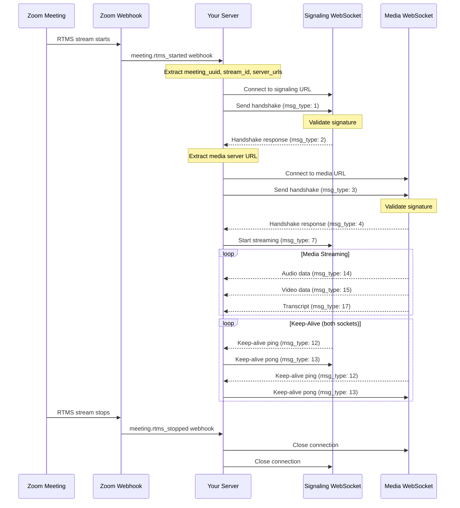
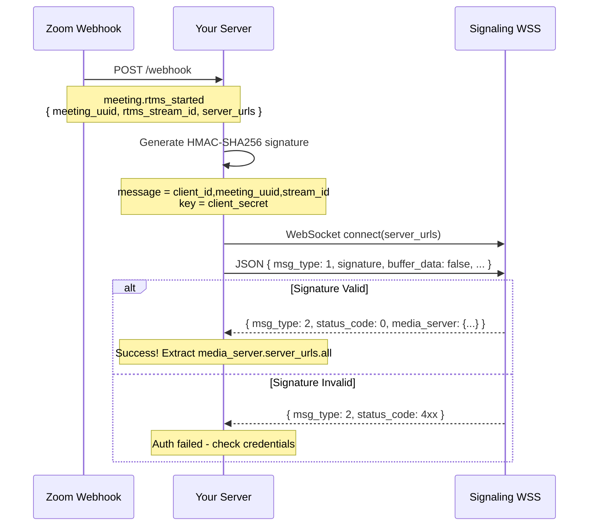
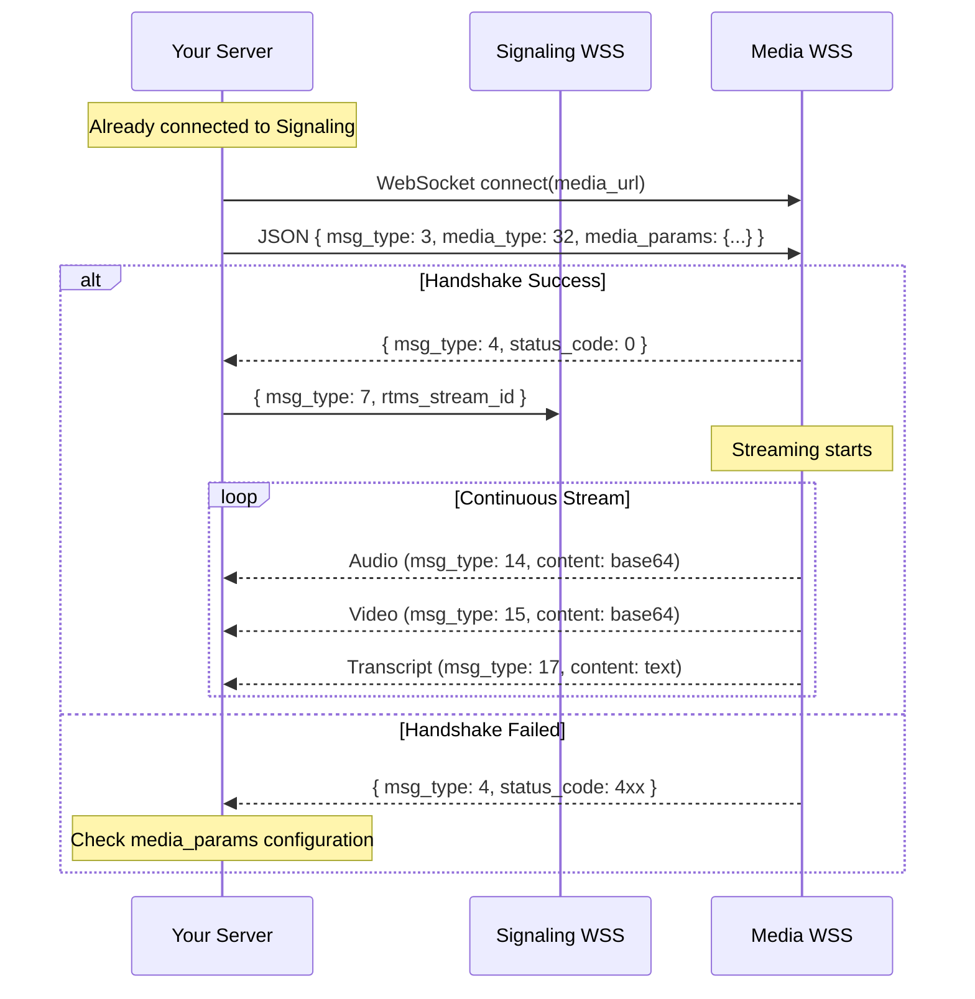
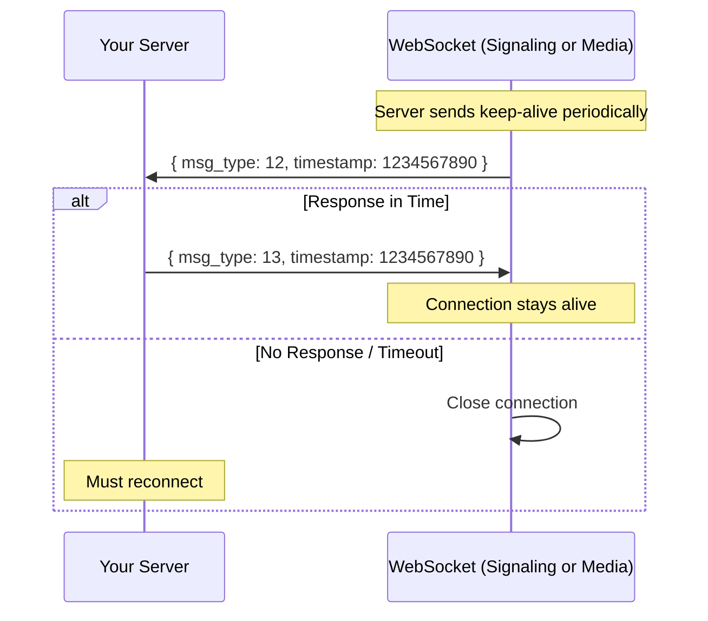
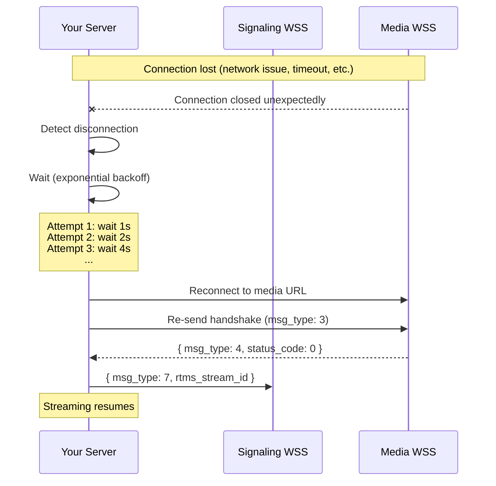

# RTMS Architecture

## Connection Flow (Overview)

```
┌─────────────────┐     ┌──────────────────┐     ┌─────────────────┐
│   Zoom Meeting  │────▶│  Webhook Event   │────▶│   Your Server   │
│                 │     │ meeting.rtms_    │     │                 │
│                 │     │ started          │     │                 │
└─────────────────┘     └──────────────────┘     └────────┬────────┘
                                                          │
                        ┌──────────────────┐              │
                        │ Signaling WSS    │◀─────────────┘
                        │ (Handshake)      │
                        └────────┬─────────┘
                                 │
                        ┌────────▼─────────┐
                        │  Media WSS       │
                        │ (Audio/Video/    │
                        │  Transcript)     │
                        └────────┬─────────┘
                                 │
                        ┌────────▼─────────┐
                        │  Your Processing │
                        │  (NLP, Storage,  │
                        │   Streaming)     │
                        └──────────────────┘
```

## Sequence Diagrams

### Full Connection Flow



### Webhook to WebSocket Handshake



### Media Handshake and Streaming



### Keep-Alive Protocol



### Reconnection Flow (RTMSManager Handles This)



## Implementation Approaches

### 1. RTMSManager (Recommended)

The `RTMSManager` library handles connection management, reconnection, and event routing automatically:

```javascript
import { RTMSManager } from './library/javascript/rtmsManager/RTMSManager.js';

await RTMSManager.init(config);
RTMSManager.on('audio', handleAudio);
RTMSManager.on('video', handleVideo);
RTMSManager.on('transcript', handleTranscript);
await RTMSManager.start();
```

→ See [`library/javascript/README.md`](./library/javascript/README.md) for full API documentation.

### 2. SDK-Based

The RTMS SDK provides a simplified interface with built-in error handling:
- Automatic connection management
- Built-in reconnection logic
- Cross-platform compatibility

→ See [`boilerplate/working_sdk/`](./boilerplate/working_sdk/) for examples.

### 3. Native WebSocket

For maximum control, implement WebSocket connections directly:
- Manual handshake and authentication
- Custom reconnection strategies
- Direct binary data processing

→ See [RTMS_CONNECTION_FLOW.md](./RTMS_CONNECTION_FLOW.md) for the complete protocol specification with code examples in JavaScript, Python, and Go.

## Message Type Summary

| msg_type | Name | Socket | Direction |
|----------|------|--------|-----------|
| 1 | SIGNALING_HANDSHAKE_REQ | Signaling | Client → Server |
| 2 | SIGNALING_HANDSHAKE_RESP | Signaling | Server → Client |
| 3 | MEDIA_HANDSHAKE_REQ | Media | Client → Server |
| 4 | MEDIA_HANDSHAKE_RESP | Media | Server → Client |
| 7 | START_MEDIA_REQ | Signaling | Client → Server |
| 12 | KEEP_ALIVE_REQ | Both | Server → Client |
| 13 | KEEP_ALIVE_RESP | Both | Client → Server |
| 14 | MEDIA_DATA_AUDIO | Media | Server → Client |
| 15 | MEDIA_DATA_VIDEO | Media | Server → Client |
| 16 | MEDIA_DATA_SHARE_SCREEN | Media | Server → Client |
| 17 | MEDIA_DATA_TRANSCRIPT | Media | Server → Client |
| 18 | MEDIA_DATA_CHAT | Media | Server → Client |

## Related Documentation

- [RTMS_CONNECTION_FLOW.md](./RTMS_CONNECTION_FLOW.md) - Protocol details with code examples
- [MEDIA_PARAMETERS.md](./MEDIA_PARAMETERS.md) - Audio/video configuration options
- [PRODUCTION.md](./PRODUCTION.md) - Distributed architecture & scaling
