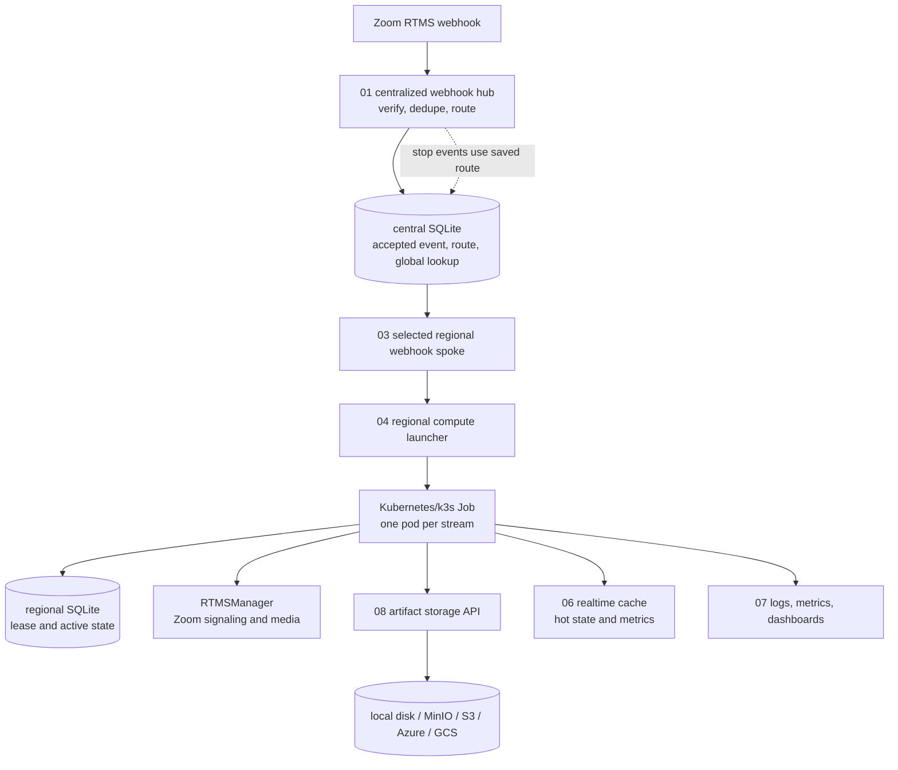

# RTMS Distributed Sample

This sample is organized as numbered layers so the code matches the architecture.

The first cut stays intentionally simple: HTTP handoff between layers, SQLite-backed control data for local development, and `RTMSManager` only inside the compute Job/pod.

As a rough planning number, assume one decently sized box can serve about 40 concurrent RTMS meetings or sessions comfortably, depending on enabled media types and processing work. The architecture target is to support up to 10,000 concurrent RTMS meetings or sessions by keeping media compute regional, using direct selected-spoke handoff for the first sample, keeping hot control data in small SQL stores, and keeping large media bytes in blob storage instead of the control database. Treat that as a design target that still needs load testing against the actual media mix, node sizes, SQLite/Postgres/distributed-store configuration, and measured Zoom latency.

This is one practical way to architect the system, not the only way. Other designs may work better depending on cloud provider, queue platform, database choice, latency requirements, compliance needs, team experience, and operating budget.

## Numbered Layers

1. `01-centralized-webhook-hub`
   Centralized US webhook hub. Receives Zoom RTMS webhooks, verifies the Zoom signature and timestamp, validates the basic payload shape, rejects stale requests, drops duplicate RTMS retry attempts, chooses one regional spoke, and forwards the accepted webhook body.

2. `02-central-route-dispatcher`
   Local HTTP dispatcher shim for selected-spoke handoff. In the production target, this responsibility should be folded into the centralized webhook hub outbox/dispatcher.

3. `03-regional-webhook-spoke`
   Represents the selected regional webhook spoke. It does not decide whether work belongs to the region; it receives work already selected by the hub/dispatcher, verifies the internal signature, persists regional state, then forwards directly to the regional compute launcher endpoint.

4. `04-regional-compute-launcher`
   Regional HTTP launcher that receives the spoke handoff on ports such as `4710-4713` and creates one deterministic Kubernetes Job per `rtms_stream_id`. For local testing, all four launchers can point at the same remote k3s endpoint. In production, each launcher should use the correct regional Kubernetes or container-service endpoint.

5. `04-regional-compute-job`
   Represents one Kubernetes Job/pod per RTMS stream. The pod receives or loads the full accepted webhook, claims the stream lease, then hands the original RTMS webhook to `RTMSManager`. It can record audio/video using the same helper path as the `save_audio_and_video_to_aws_s3_storage_js` sample, but uploads final files through this sample's artifact web service instead of writing directly to S3. The pod exits when the stream finishes.

6. `05-control-store`
   Receives global state, generated Markdown metadata, event metadata, and blob-like artifacts. The local sample now uses SQLite. If you later need multiple writer replicas or managed HA, keep the same store contract and swap SQLite for Postgres, distributed SQL, NoSQL conditional writes, or another transactional store.

7. `06-realtime-cache`
   Optional Redis-like HTTP service for fast state during the meeting: live summaries, counters, monitoring views, a simple dashboard, and a Prometheus `/metrics` endpoint. This is not the source of truth after the meeting.

8. `07-observability-dashboarding`
   Optional observability, logging, dashboarding, and reporting layer for operators and users. It reads from the control store/blob storage for durable reporting, Loki/Prometheus for logs and metrics, and the realtime cache service for active-meeting views.

9. `08-artifact-storage`
   Web service for final artifact uploads. It exposes one HTTP API and writes bytes to local filesystem, S3/MinIO, Azure Blob Storage, or Google Cloud Storage. The compute job uploads final media files, transcripts, summaries, and manifests here. The control store keeps metadata and `blobUri` pointers; it does not store media bytes.

`shared` contains common envelope, region, HTTP, and signature helpers.

## Architecture Diagram



## Flow

```text
Zoom RTMS webhook
  -> 01-centralized-webhook-hub, US hub
  -> hub SQLite, accepted webhook idempotency
  -> route dispatcher SQLite, selected stream route
  -> selected 03-regional-webhook-spoke
  -> 04-regional-compute-launcher, regional HTTP endpoint, 4710-4713 in local test
  -> Kubernetes Job, one pod per stream
  -> regional SQLite control store, lease + active state
  -> 04-regional-compute-job / RTMSManager
  -> 05-control-store
  -> 08-artifact-storage, final artifact bytes
  -> 06-realtime-cache, optional hot state
  -> 07-observability-dashboarding, optional logs, metrics, dashboards, reports
```

For `rtms_started`, the centralized hub extracts the routing code from `payload.server_urls`, maps it to a deployed spoke group, and forwards the accepted webhook to that selected spoke.

For `rtms_stopped`, the centralized hub looks up the saved stream route by `rtms_stream_id`, because stop events do not include the signaling URL region code.

## Region Flexibility

The Zoom signaling URL may contain a location code such as `IAD`, `SJC`, or `SIN`. Treat that as routing input, not as a fixed deployment list. The parser preserves new plausible codes so they can be logged and mapped later.

Known discovered codes:

```text
SJC, IAD, AMS, FRA, MEL, SYD, YYZ, SIN, NRT, HKG
```

You do not need to run every Zoom code as its own region. Start with the spoke groups where you actually deploy compute. New, unmapped, or unparsable codes should go to the US fallback group and alert so you can decide whether to add an explicit mapping later.

Example four-spoke deployment:

```text
amer-west, amer-east, europe, apac-hub
```

RabbitMQ queue definitions are still included as an optional experiment, but they are not on the default direct-spoke path. If you want to test the optional queue topology, generate definitions from the region list:

```bash
npm run rabbitmq:generate -- --regions IAD,SJC,AMS,FRA,SIN
```

That creates regional start/stop/recovery queues such as:

```text
rtms.start.region.iad
rtms.stop.region.iad
rtms.recovery.region.iad
```

Only `rtms.start.region.*` queues get the 60-second TTL. Expired start messages are routed to:

```text
rtms.warning.start_expired
```

To add a region, add the code to the region list and regenerate the definitions. To remove a region, drain or delete its queues first, remove the code, then regenerate. The application should not hard-code "five regions" as a system rule.

## Why This Shape

This keeps the roles clean:

- The centralized webhook hub is only the public Zoom-facing receiver.
- The centralized webhook hub owns first-attempt acceptance and duplicate filtering in SQLite.
- The route dispatcher owns selected-spoke route persistence in SQLite for this sample.
- The selected regional spoke owns local regional handoff to worker/compute endpoints so compute can stay closer to Zoom media paths.
- The regional SQLite control store owns the active lease and active stream state for streams assigned to that region.
- The compute Job owns only the per-stream wrapper logic after it claims the regional lease. `RTMSManager` owns RTMS signaling, media sockets, reconnect behavior, stream close, and emitted media/lifecycle events.
- The control-store layer owns global queryable state and artifact writes during and after the meeting.
- The artifact-storage service owns final artifact bytes and returns stable `blobUri` pointers.
- The realtime cache owns fast, disposable active-meeting views during the meeting.
- The observability/dashboarding layer owns logs, metrics, human-facing views, and reports.

SQLite is the local default so the sample is easy to run and inspect. For larger production deployments, the important requirement is not the brand of database; it is durable idempotency, route persistence, conditional lease writes, fencing, backups, and a clear blob-storage lookup model.

## Reliability Rules

The webhook receiver should be fire-and-forget from Zoom's point of view, but not fire-and-forget inside our system.

Recommended ingress rule:

```text
Zoom webhook
  -> capture raw request body
  -> verify x-zm-signature with the Zoom webhook secret token
  -> reject replayed or stale x-zm-request-timestamp values
  -> validate basic webhook shape
  -> build normalized envelope for internal storage and routing
  -> accept the idempotency key and selected spoke in durable storage
  -> insert the selected-spoke dispatch intent in the same transaction
  -> return 204 to Zoom only after the transaction commits
  -> publish/forward to the selected regional spoke after commit
```

The hub fails closed by default. Any event that is not `endpoint.url_validation` must pass Zoom signature verification before it is routed to HTTP or RabbitMQ.

If the hub cannot durably accept the webhook, return `503` so Zoom can retry instead of silently losing the event.

A stale webhook timestamp is not a stream-health decision. It is replay protection. Zoom signs the timestamp and raw request body; the hub should reject requests that are outside a short clock-skew window, such as too old or too far in the future, so an old captured webhook cannot be replayed later.

RTMS retry handling belongs to the webhook hub. The first verified and durably accepted attempt for an RTMS webhook idempotency key wins. Later retry attempts for the same RTMS event should return success to Zoom and be dropped internally. They should not be routed again, launched again, re-claimed, or allowed to disturb an existing stream. The final protection is still the lease: no compute pod may open Zoom signaling or media sockets unless it has successfully claimed the stream lease.

The local `01` hub stores RTMS idempotency keys in SQLite. The default retention is 65 minutes:

```text
WEBHOOK_IDEMPOTENCY_TTL_MS=3900000
```

That is intentionally longer than Zoom's 60-minute retry window. Each key is stored with an `expires_at_ms` value, and the hub deletes expired keys on a periodic sweep and while counting/accepting keys. In production, this same key must be stored in a durable store so duplicate filtering survives hub restarts and multiple hub replicas.

For `rtms_started`, the production-grade version should accept the idempotency key, persist the stream route, persist the initial stream state, and insert the selected-spoke outbox message in one transaction. After commit, an outbox publisher dispatches the accepted webhook to exactly one regional spoke. If the hub crashes after commit but before publish, another hub instance can publish the pending outbox row. If the idempotency key already exists, the event is an RTMS retry attempt and is acknowledged/dropped internally.

For `rtms_stopped`, the hub should look up the stored route by `rtms_stream_id`, because stop events do not carry the signaling URL region code. If the route is missing, record a warning/alert and send the event to a controlled fallback or DLQ; do not broadcast it to every region and ask regional spokes to decide.

Important terms:

| Term | Meaning |
|------|---------|
| Transient failure | Temporary problem such as timeout, dropped socket, 429, 500, 502, 503, or 504. Retry with backoff. |
| Permanent failure | Bad signature, malformed payload, missing stream ID, bad auth, or non-retryable 4xx. Do not keep retrying. |
| Stale webhook timestamp | A signed webhook timestamp outside the accepted clock-skew window. Reject it to prevent replay attacks. |
| Idempotency key | Stable duplicate-detection key for the same Zoom event. Safe consumers should process the same key once. |
| RTMS retry attempt | A repeated RTMS webhook delivery with an idempotency key that was already accepted. Return success to Zoom, drop it internally, and do not re-route or reconnect. |
| Full jitter backoff | Randomized exponential retry delay. This prevents every node from retrying at the same time. |
| DLQ | Dead-letter queue for messages that cannot be processed after normal retry/validation paths. |

Current helper files:

```text
shared/retry.js          generic full-jitter retry helper
shared/errors.js         transient HTTP/network error classification
shared/idempotency.js    stable webhook idempotency key builder
shared/internalSignature.js HMAC signing for dispatcher-to-spoke internal delivery
shared/rabbitmq.js       RabbitMQ confirm publish and ack/nack helpers
shared/sqliteRoutingStore.js SQLite idempotency and stream-route helper
shared/postgresRetry.js  optional retry helper if you swap the store to Postgres later
shared/zoomSignature.js  Zoom webhook signature and URL-validation helpers
```

Default policies:

| Operation | Default behavior |
|-----------|------------------|
| Hub HTTP mode | Current sample path. The hub verifies Zoom, accepts the first RTMS attempt, then hands off to the dispatcher and selected spoke by signed HTTP. |
| Optional RabbitMQ mode | Experimental swap-in for replay/backpressure testing. It is not the default path for this design. |
| Dispatcher-to-spoke HTTP | Signed with `INTERNAL_WEBHOOK_SECRET`; regional spokes reject missing, stale, or invalid internal signatures. |
| HTTP internal calls | Retry transient failures up to 3 attempts with backoff. |
| RabbitMQ publish | Retry transient publish/connect failures up to 5 attempts with publisher confirm. |
| SQLite operation | Use WAL mode, a busy timeout, and short transactions. |
| Swapped SQL store operation | Retry only known transient database errors, not validation errors. |
| RTMS lease renew | Retry briefly; if ownership cannot be proven, close the local RTMS connection. |
| Blob upload | Retry transient storage failures; if exhausted, mark upload failed in the control store. |
| Webhook verification | Always required for non-validation webhook events. |

Zoom signature verification uses the official message format:

```text
v0:{x-zm-request-timestamp}:{raw request body}
```

The hub hashes that string with the Zoom webhook secret token and compares it with `x-zm-signature` before routing. The timestamp tolerance defaults to 300 seconds to reduce replay risk:

```text
WEBHOOK_TIMESTAMP_TOLERANCE_SECONDS=300
```

Do not retry these forever:

```text
invalid Zoom signature
missing event or payload
missing rtms_stream_id
unknown required route with no UNKNOWN fallback
permanent 4xx from an internal API
malformed JSON
```

The hub supports both delivery modes:

```bash
HUB_DELIVERY_MODE=http npm run start:hub
HUB_DELIVERY_MODE=rabbitmq npm run start:hub
```

Use `rabbitmq` mode only when testing the optional queue experiment.

## SRE Single Points Of Failure

The local Docker sample has many single points of failure because it is meant to be easy to run on one machine. Production should remove the single points on the request path and preserve enough state for another node to take over safely.

Most important rule:

```text
Durable route + signed regional handoff + durable lease store must survive any one pod/node failure. A queue can be added later, but it is not on the current direct-spoke path.
```

Current SPOF review:

| Component | Current sample risk | Production fix |
|-----------|---------------------|----------------|
| Docker host | One host failure loses all local services. | Use Kubernetes across at least 3 worker nodes and multiple availability zones where possible. |
| Webhook hub | One hub process can fail or be overloaded. | Run 2+ hub replicas behind a load-balanced HTTPS endpoint. Durably write idempotency, route, and dispatch intent before returning success to Zoom. |
| Optional RabbitMQ | Single broker means optional queue ingress stops if the broker dies. | If you enable RabbitMQ later, use a 3-node RabbitMQ cluster with quorum queues, publisher confirms, durable messages, and DLQ. |
| Hub dispatch/outbox publisher | One process can stop forwarding accepted events to regional spokes. | Run 2+ stateless hub replicas or dispatch publishers. Durable idempotency and outbox rows prevent duplicate routing. |
| Regional spoke/worker handoff | One regional spoke can stop new worker handoff. | Run 2+ spoke/worker replicas per active region and make worker/Job creation idempotent with deterministic Job names. Add a real queue later if direct handoff needs durable replay. |
| Compute Job | A pod can die while connected to Zoom RTMS. | Use one Job/pod per stream, lease expiry for takeover, and `RTMSManager.stop()` / `RTMSManager.requestStreamClose()` for RTMS lifecycle cleanup. Never allow connection without a valid lease. |
| SQLite control database | A local SQLite file is a single-node control-plane dependency. | Keep it on SSD-backed persistent storage for the sample. For multi-replica production, swap the store contract to HA Postgres, distributed SQL, or another transactional store with backups and tested restore. |
| Redis realtime cache | Cache loss removes live views and hot summaries. | Treat cache as rebuildable. For production use Redis/Valkey HA, Sentinel, cluster mode, or a managed equivalent. |
| Blob storage | Local MinIO or filesystem can lose final artifacts. | Use cloud blob storage by default. If self-hosting MinIO, run distributed MinIO with erasure coding across multiple nodes/disks. |
| Local pod disk | Node death can lose temporary chunks. | Keep pod disk as scratch only. Anything reusable must be in the control store or blob storage. |
| Observability stack | If Loki/Prometheus/Grafana dies, operators are blind. | Run HA observability or use managed logging/metrics. Keep alerts outside the same failing cluster where possible. |
| Secrets/config | One `.env` or hand-edited YAML can drift or leak. | Use Kubernetes Secrets, sealed secrets, cloud secret managers, and config rollout checks. |
| Deployment pipeline | One bad deploy can break every region. | Use region-by-region rollout, canaries, readiness probes, and fast rollback. |

Recommended production baseline:

```text
US HTTPS load balancer
  -> 2+ centralized webhook hub pods
  -> central SQLite for the sample, or HA transactional store for production
     - accepted webhook, idempotency, selected route, outbox, global metadata
  -> selected regional spoke pods
  -> regional SQLite for the sample, or HA transactional store for production
     - full accepted webhook copy, active lease, active state, heartbeats, recovery
  -> 2+ regional spoke/worker pods per active region
  -> N compute pods per active region
  -> cloud blob storage
  -> Redis/Valkey HA for active-meeting cache
```

The control store is no longer a single logical role in this design. The central store is the global control and lookup store near the hub. The regional store is the hot lease/state store near regional compute. In this sample both can be SQLite files. If you need multiple active writer replicas, use the same interface with Postgres, distributed SQL, or another store that supports conditional writes/transactions.

Control-store failure behavior:

| Scenario | Expected behavior |
|----------|-------------------|
| Regional control store briefly unavailable | Existing compute nodes retry lease renewals briefly. New claims in that region pause. |
| Lease cannot be renewed | Compute node must close the RTMS connection because it can no longer prove ownership. |
| Regional database fails over or recovers | Clients retry reconnects; nodes resume lease renewals after recovery. |
| Central control store briefly unavailable | New webhook acceptance or route lookup may pause; the hub should return `503` if it cannot durably accept. |
| Control-store data lost | Restore from backup. This is why backups and restore drills are required for both central and regional databases. |

Direct handoff and optional queue failure behavior:

| Scenario | Expected behavior |
|----------|-------------------|
| Direct hub-to-spoke handoff fails | Retry with backoff, keep the durable dispatch intent pending, and alert if `rtms_started` cannot be handed off inside the 60-second budget. |
| Hub dispatch publisher dies | Durable outbox keeps the dispatch intent until another hub publisher sends it. |
| Regional worker endpoint fails | Record the failed handoff, retry within the freshness budget for `rtms_started`, and alert if no worker accepts it. |
| Optional RabbitMQ publish fails | Hub returns `503` so Zoom can retry the webhook, or leaves the dispatch intent pending if the webhook was already durably accepted. |
| Optional RabbitMQ consumer dies | The queue keeps the event until another consumer can claim the stream. |
| Message is malformed or permanently invalid | Record the failure with error metadata and do not retry forever. |

Minimum alert list:

```text
webhook 5xx rate
regional worker handoff failure rate
regional worker handoff latency
optional RabbitMQ queue depth / DLQ count if queue mode is enabled
central control store availability
regional control store availability by region
database replication lag if using replicated SQL
database busy/lock wait time
lease renewal failure rate
lease takeover count
active streams by region
compute node capacity used
RTMS signaling/media latency
first media packet latency
blob upload failures
Loki/Prometheus ingestion failures
```

SRE priority order:

1. Make webhook acceptance durable with idempotency and selected-spoke outbox rows before returning success to Zoom.
2. Put central and regional control stores on SSD-backed persistent storage, with backups and restore drills. If you need multiple writers, swap SQLite for HA Postgres/distributed SQL.
3. Run multiple hub, spoke/worker, and compute pods.
4. Keep regional worker handoff isolated so one busy region does not block all regions.
5. Move final artifacts to cloud blob storage or distributed MinIO.
6. Add alerts for worker handoff failures, optional queue age/DLQ, lease failures, and RTMS latency.

## RTMS Timing Constraints

RTMS has strict reconnect windows after a disconnect:

| Connection | Reconnect budget |
|------------|------------------|
| Signaling server | 60 seconds |
| Media server | 60 seconds |

This matters for orchestration. A new node cannot wait several minutes to take over; by then Zoom may have already stopped waiting for the reconnect.

Recommended timing model:

```text
disconnect detected
  -> reconnect locally immediately
  -> keep renewing the stream lease only while this node still owns the stream
  -> if the node cannot reconnect inside the RTMS window, close/release and let recovery happen
  -> if the node dies, another node can claim only after lease expiry
```

Lease settings must leave room inside the 60-second RTMS reconnect window:

```text
LEASE_TTL_MS should be less than 60000
LEASE_RENEW_INTERVAL_MS should be much smaller than LEASE_TTL_MS
```

The sample defaults follow that shape:

```text
LEASE_TTL_MS=45000
LEASE_RENEW_INTERVAL_MS=15000
```

Why this matters:

- If the lease TTL is longer than 60 seconds, a dead node can block takeover until after Zoom's reconnect window has expired.
- If the renew interval is too close to the TTL, normal network jitter can cause false lease loss.
- If takeover happens without a lease check, two nodes may connect to the same Zoom RTMS stream and race.
- If retry backoff is too slow, the node can spend the whole 60-second window sleeping instead of reconnecting.

Suggested operational targets:

| Event | Target |
|-------|--------|
| Detect signaling disconnect | immediate from WebSocket close/error |
| First local reconnect attempt | within 1-3 seconds |
| Detect failed lease renewal | within one renew interval |
| Allow takeover after dead node | about 45 seconds with current defaults |
| Give up stale ownership | before 60 seconds if ownership cannot be proven |
| Alert on reconnect pressure | reconnect attempts, failures, and elapsed reconnect time |

The system should track these timestamps per stream:

```text
last_signaling_connected_at
last_signaling_disconnected_at
last_media_connected_at
last_media_disconnected_at
last_reconnect_attempt_at
reconnect_deadline_at
lease_expires_at
```

For a disconnect, set `reconnect_deadline_at = disconnected_at + 60 seconds`. If that deadline passes, the current node should stop trying to use stale ownership and record a recovery event.

## Disk And IOPS Requirements

Do not run real RTMS media workloads on HDD-backed instances or HDD-backed persistent volumes. Real-time audio/video workloads are sensitive to disk stalls, queue flush latency, database WAL latency, and temporary media spool writes.

Use SSD-backed storage for every service that writes on the hot path:

| Component | SSD requirement |
|-----------|-----------------|
| Compute nodes | SSD/NVMe scratch disk for temporary media spool, logs, and local buffers. |
| SQLite/control store | SSD-backed database and WAL volumes. Prefer provisioned IOPS when concurrency is high. |
| RabbitMQ | SSD-backed broker data volume for durable/quorum queues and publisher confirms. |
| Redis/Valkey | SSD-backed persistence volume if AOF/RDB is enabled. |
| MinIO/object storage | SSD-backed disks for local/self-hosted object storage. Cloud blob storage should use the provider's durable storage tier. |
| Observability | SSD-backed Loki/Prometheus volumes so logging and metrics ingestion do not stall. |

HDD is acceptable only for offline archive or cold backup. It should not be used for:

```text
active media spool
SQLite/control-store data/WAL
RabbitMQ durable queues
Redis AOF
Loki/Prometheus ingestion
local object storage receiving final media artifacts
```

Kubernetes scheduling rule:

```text
Compute pods that handle RTMS media should run only on nodes labeled for SSD/NVMe storage.
PersistentVolumeClaims for SQLite/control store, RabbitMQ, Redis, Loki, Prometheus, and MinIO should use SSD-backed storage classes.
```

This does not mean media bytes should go into the control database. It means the control plane, queues, cache persistence, observability, and any temporary media spool must not be slowed down by HDD latency.

## Merged Earlier Draft Notes

This section merges the useful parts from the earlier `rtms-samples/distributed-architecture` draft.

Some older assumptions are intentionally updated here:

- The updated local shape uses SQLite for accepted webhooks, idempotency, route selection, global lookup, active leases, active stream state, worker/compute heartbeats, and recovery state. Larger production deployments can keep the same store contract and swap SQLite for Postgres, distributed SQL, or another durable transactional store.
- RabbitMQ is optional in this repository. The current default sample uses direct dispatcher-to-spoke delivery and direct spoke-to-worker delivery. Add a queue later only if you need durable regional replay/backpressure.
- Blob storage presents final or combined artifacts to users. Keep pod-local storage as temporary scratch in this sample.
- The Redis-like layer is for active-meeting speed and monitoring views. It is not the durable source of truth.
- Provider-specific cloud service names and regions are examples, not promises. Verify current service capabilities and real RTMS latency before production placement.

### Current Architecture Map

```text
Zoom RTMS webhook
  -> 01-centralized-webhook-hub, US hub
     - verify Zoom signature
     - reject stale webhook timestamps
     - accept first RTMS attempt by idempotency key
     - map start event routing hint to one spoke group
     - look up stored route for stop
     - persist idempotency, route, state, and selected-spoke dispatch intent
     - forward the accepted webhook to the selected regional spoke after commit
  -> central SQLite control data
     - accepted webhook idempotency, selected route, global lookup, dispatch intent
  -> selected regional webhook spoke
     - authenticate internal dispatcher call
     - forward directly to local worker/compute endpoint
     - do not make selected-spoke routing decisions
  -> regional SQLite control data
     - full accepted webhook copy, active lease, active state, heartbeat, recovery
  -> 04-regional-compute-job pods
     - claim stream lease in the selected regional control store
     - call RTMSManager.handleEvent with the original webhook event and payload
     - let RTMSManager connect RTMS signaling and media
     - renew lease while connected
     - write status, metadata, and final artifact pointers
  -> 05-control-store
     - central SQLite global lookup in the sample
     - regional-to-central state/artifact sync
     - blob lookup metadata
     - generated Markdown metadata
  -> 06-realtime-cache
     - live summary and active-meeting state
  -> 07-observability-dashboarding
     - logging, metrics, operators, users, SRE views

Zoom App HTTPS traffic
  -> global app traffic manager
  -> regional app backend
  -> control store / Markdown query store / blob storage / realtime cache
```

Direct HTTP delivery does not provide the single-owner guarantee. It only moves work. The single-owner guarantee comes from the control-store lease transaction before a compute node opens Zoom signaling or media sockets.

### Message Envelope Contract

Use a stable internal envelope before queueing or forwarding events between layers.

```json
{
  "schemaVersion": "2026-05-18",
  "source": "zoom",
  "event": "meeting.rtms_started",
  "eventType": "rtms_started",
  "productType": "meeting",
  "rtmsId": "meeting_uuid_or_session_id",
  "streamId": "rtms_stream_id",
  "regionCode": "IAD",
  "idempotencyKey": "meeting.rtms_started:rtms_stream_id:event_ts",
  "receivedAt": "2026-05-18T00:00:00.000Z",
  "eventTs": 1780000000000,
  "webhook": {
    "event": "meeting.rtms_started",
    "payload": {
      "server_urls": "original Zoom payload field"
    }
  },
  "payload": {
    "server_urls": "redacted original Zoom payload field"
  }
}
```

Envelope rules:

- `schemaVersion` lets later workers reject or transform old message shapes.
- `idempotencyKey` must be stable for the same Zoom delivery so retries are safe.
- `regionCode` is a routing hint extracted from Zoom signaling/media URLs. If parsing fails, use `UNKNOWN`.
- `streamId` is the ownership key. Lease, route, idempotency, metrics, and artifacts should all connect back to it.
- `webhook` carries the full accepted Zoom webhook body from the hub for the compute Job. The top-level `event` and `payload` fields remain for routing and backward compatibility.
- Do not put storage credentials, raw media bytes, or user-facing signed URLs inside the envelope.

### Region Routing Policy

The discovered codes are useful routing hints:

```text
SJC, IAD, AMS, FRA, MEL, SYD, YYZ, SIN, NRT, HKG
```

Suggested policy:

- Known code and deployed spoke group exists: the hub selects that spoke group and writes one dispatch intent.
- Known code but selected spoke is unavailable: retry hub dispatch with backoff, then DLQ if it cannot be delivered inside policy.
- Missing or unparsable code: route to the configured US fallback group and alert.
- New code with no configured spoke group: route to US fallback, record the new code, then decide whether to map it to `amer-west`, `amer-east`, `europe`, or `apac-hub`.
- RTMS retry attempt: return success and drop internally if the idempotency key was already accepted.
- Stop event: look up the stored route by `rtms_stream_id`, because the stop payload does not carry the region code.
- Stop route replay: if the saved route is already a spoke group such as `amer-west`, send the stop back to that spoke group directly. Do not uppercase it and treat it like a Zoom routing code, or it can fall back to the wrong region.

Regional spokes should not inspect the routing hint to decide ownership. If a spoke receives a webhook from the hub, it treats that webhook as already selected and starts local processing.

`IAD` is commonly used as a Northern Virginia / Washington Dulles style routing code. Treat it as a Zoom routing hint, not as proof of a specific data center location.

### Direct Spoke Handoff And Optional Queue Swap

The default sample does not put a regional queue between the selected regional webhook spoke and the worker endpoint. The dispatcher signs the envelope, sends it directly to the selected regional spoke, and the spoke sends it directly to configured worker/compute endpoints.

That means the regional webhook process should stay thin:

- verify the internal HMAC signature
- validate `event` and `streamId`
- write small regional control records
- forward to the regional compute launcher endpoint
- return quickly

The current test shape keeps the spoke and compute launcher as separate services. The spoke listens on the `4610-4613` range, and the launcher listens on the `4710-4713` range. The launcher then creates the Kubernetes Job. In production, run each regional launcher near the correct regional Kubernetes cluster or container service instead of sending all regions to one shared test cluster.

When the launcher creates Jobs in a remote k3s or Kubernetes cluster, the URLs injected into the pod must be reachable from inside that cluster. `REGIONAL_STORE_URL=http://127.0.0.1:4510` works for PM2 processes on the host, but inside a pod `127.0.0.1` means the pod itself. For remote k3s testing, set per-launcher overrides such as `COMPUTE_REGIONAL_STORE_URL=http://<launcher-host-lan-ip>:4510` and `COMPUTE_CENTRAL_STORE_URL=http://<launcher-host-lan-ip>:4510`.

RabbitMQ is still included because it runs well in Docker, supports durable queues, publisher confirms, DLQs, and is easy to inspect locally. Treat it as an optional swap-in when you need durable replay/backpressure between spoke and workers.

The same architecture can use other queue systems:

| Queue option | Where it fits |
|--------------|---------------|
| RabbitMQ | Local sample, self-hosted deployments, AMQP-based regional queues |
| AWS SQS/SNS/EventBridge | AWS-native durable queueing and event routing |
| Azure Service Bus | Azure-native queues/topics, DLQs, and sessions |
| Google Pub/Sub | Google Cloud-native pub/sub and regional subscribers |
| Kafka | High-throughput event log and replay, heavier operational model |
| NATS JetStream | Lightweight self-hosted stream/queue option |

Whichever delivery mechanism is used, assume duplicates can happen. Workers must be idempotent, and compute nodes must acquire the stream lease before connecting to Zoom.

### Regional Compute Launcher Contract

Each active region runs one regional spoke and one regional compute launcher close to its worker nodes or Kubernetes cluster.

Responsibilities:

- Accept only signed internal delivery from the central dispatcher.
- Forward only work already selected for that spoke group.
- Send the full accepted webhook envelope from the spoke to the regional launcher.
- Have the launcher create one Kubernetes Job per RTMS stream attempt.
- Use a deterministic Job name derived from `rtms_stream_id`, usually a sanitized hash, so retrying Job creation is idempotent.
- Write launch status and failures to the regional control store for operator visibility, then fan back summary state to the central control store.
- Send failed launches to a launch-failure table or alert path after retry.

Regional direct-handoff policy:

- If the regional spoke is down, the dispatcher direct HTTP call fails and should retry/back off or alert.
- Do not let another region launch the stream by default.
- For `rtms_started`, alert if the selected spoke or regional launcher cannot accept the task inside the 60-second RTMS timing budget.
- For `rtms_stopped`, do not enforce a freshness limit. Late stop events should still update state and trigger cleanup.

The regional spoke does not choose the region; the hub already selected it. The spoke forwards work; the regional launcher creates the container job; neither proves stream ownership. The compute Job still claims the regional lease before connecting to Zoom.

### Zoom Apps Serving Path

Zoom Apps need a separate HTTPS serving path from the RTMS ingestion path.

```text
Zoom Client / Zoom App
  -> global traffic manager or global application load balancer
  -> nearest healthy regional app backend
  -> control store for stream state and authorization checks
  -> Markdown query store for rendered summaries and notes
  -> blob storage for final artifacts through short-lived signed URLs
  -> realtime cache for active-meeting status
```

The global traffic manager should route only. It should not own stream state, user sessions, blob credentials, or RTMS ownership.

Recommended access rules:

- The Zoom App frontend calls only the app backend.
- The backend validates Zoom App context and user authorization before reading stream data.
- The frontend never receives database, Redis, queue, or object-storage credentials.
- The backend returns filtered metadata or short-lived signed URLs for blobs.
- User-facing app writes should be limited to annotations, preferences, or explicit document edits.
- Stream route ownership should be written by the webhook hub; active connection ownership should be written by regional compute job workflows.

### Kubernetes Compute And Takeover

Run RTMS compute as one Kubernetes Job per RTMS stream.

Kubernetes starts and cleans up pods, but it does not decide stream ownership. Ownership still comes from the lease in the selected region's control store.

The compute Job should stay thin. It should not copy `signalingSocket`, `mediaSocket`, handshake, reconnect, or media parsing logic out of `RTMSManager`. Its core job is:

```text
load accepted webhook
  -> claim regional lease
  -> RTMSManager.init(...)
  -> RTMSManager.handleEvent(webhook.event, webhook.payload)
  -> listen to RTMSManager events and write selected metadata
  -> record final audio/video artifacts when media recording is enabled
  -> batch live counters to the realtime cache service
  -> on stop/SIGTERM, call RTMSManager.stop() or requestStreamClose()
  -> upload final media/manifest files through 08-artifact-storage
  -> release the lease and exit the one-stream Job
```

If the distributed sample needs a new RTMS behavior, prefer adding a small hook or option to `RTMSManager` instead of reimplementing the RTMS protocol in the compute wrapper.

The compute image now includes the shared `rtmsManager` library plus the common helper package used by the `storage/save_audio_and_video_to_aws_s3_storage_js` sample. The storage destination is different: the compute job does not use AWS credentials directly. It writes temporary media to local pod scratch disk, converts/muxes final files with `ffmpeg`, and uploads the finished files to `08-artifact-storage`. That service then writes to MinIO, S3, Azure Blob, Google Cloud Storage, or local disk based on configuration.

Recommended baseline:

- Use one regional Kubernetes cluster or node pool per active RTMS region group.
- Run one regional spoke per region. The spoke forwards accepted, signed envelopes to local worker/compute endpoints, which can create one deterministic `Job` per `rtms_stream_id`.
- Do not pass the full accepted webhook through Kubernetes env. It can contain Zoom signaling/media URLs and meeting metadata.
- Store the full accepted webhook envelope in the selected regional control store. Pass only small startup values such as `RTMS_STREAM_ID`, `RTMS_ENVELOPE_REF`, `REGION_CODE`, and store URLs.
- The compute pod must load the full accepted webhook from the selected regional control store before claiming the lease and connecting to Zoom.
- The store URLs passed into the compute pod must be pod-reachable. Do not pass host-local `127.0.0.1` addresses to a pod running on another VM or cluster node.
- If you want to pass the webhook directly to the pod, create a per-Job Kubernetes Secret and mount it as a read-only file. The sample launcher supports this by passing `envelope` to `launchJob`.
- Use Kubernetes Secrets for Zoom credentials and other sensitive config, not env literals in the Job manifest.
- Set `ONE_STREAM_PER_JOB=true` for Kubernetes compute so a pod exits after `rtms_stopped` has been processed and the lease is released.
- Keep launcher cleanup enabled as a backstop: the sample launcher deletes the deterministic Job and per-Job envelope Secret after `K8S_STOP_JOB_DELETE_DELAY_MS` once a stop event reaches the selected regional spoke. Per-Job envelope Secrets are also owner-referenced to the Job so Kubernetes can garbage collect them when the Job is deleted or expires.

Code-level per-Job Secret launch:

```js
await launcher.launchJob({
  streamId: envelope.streamId,
  regionCode: envelope.regionCode,
  image: 'busybox:1.36',
  envelope: envelope.webhook || { event: envelope.event, payload: envelope.payload }
});
```

That creates a Secret similar to:

```text
secret: <job-name>-envelope
file: /var/run/rtms/envelope.json
env: RTMS_ENVELOPE_FILE=/var/run/rtms/envelope.json
```

The compute wrapper supports both startup modes:

```text
RTMS_ENVELOPE_FILE=/var/run/rtms/envelope.json   # direct per-Job Secret file
RTMS_STREAM_ID=... RTMS_ENVELOPE_REF=...         # load full webhook from regional store
```

Zoom credentials should be injected separately from the per-stream webhook. The compute wrapper reads them in this order:

```text
process env
  -> *_FILE env path
  -> mounted Secret file under RTMS_SECRET_DIR
```

For Kubernetes compute pods, updating the host `.env` is not enough. Sync the relevant values into `rtms-compute-secrets` before launching new pods. Existing pods keep their original env values, so recreate failed test Jobs after a Secret update.

```text
1. normal env value, for example ZOOM_CLIENT_ID
2. explicit file env, for example ZOOM_CLIENT_ID_FILE=/var/run/rtms/secrets/ZOOM_CLIENT_ID
3. mounted Secret file under RTMS_SECRET_DIR, for example /var/run/rtms/secrets/ZOOM_CLIENT_ID
```

Kubernetes Secret example:

```bash
kubectl -n rtms create secret generic rtms-compute-secrets \
  --from-literal=ZOOM_CLIENT_ID='...' \
  --from-literal=ZOOM_CLIENT_SECRET='...' \
  --from-literal=ZOOM_SECRET_TOKEN='...' \
  --from-literal=VIDEO_CLIENT_ID='...' \
  --from-literal=VIDEO_CLIENT_SECRET='...' \
  --from-literal=VIDEO_SECRET_TOKEN='...'
```

To mount that Secret as files through the sample launcher:

```text
K8S_COMPUTE_SECRET_NAME=rtms-compute-secrets
K8S_COMPUTE_SECRET_MOUNT_PATH=/var/run/rtms/secrets
```

The generated Job sets:

```text
RTMS_SECRET_DIR=/var/run/rtms/secrets
ONE_STREAM_PER_JOB=true
```

The container does not read from the Kubernetes node or host filesystem. Kubernetes projects the Secret into the pod as a read-only volume, and the compute wrapper reads those files.
- Use liveness checks for process recovery only, not as the ownership authority.
- Use `terminationGracePeriodSeconds: 60` and have the compute wrapper call `RTMSManager.stop()` on `SIGTERM`.
- Use `PodDisruptionBudget`, topology spread constraints, and multi-zone SSD-backed node pools.
- Scale regional spoke and worker capacity from accepted webhook rate, worker handoff latency, active stream count, and error rate. Compute capacity is mostly one Job per active stream.
- Use local disk only for short-lived spool or staging. Final artifacts belong in blob storage.

Launcher and compute health should be written regularly:

```json
{
  "spokeId": "iad-spoke-001",
  "regionCode": "IAD",
  "state": "ready",
  "workerHandoffLatencyMs": 1200,
  "recentJobCreateFailures": 0,
  "cpuPct": 48,
  "memoryPct": 61,
  "lastHeartbeatAt": "2026-05-18T00:00:00.000Z"
}
```

Stream state should move through a small state machine:

```text
received
  -> routed
  -> claimed
  -> signaling_connecting
  -> signaling_connected
  -> media_connecting
  -> media_connected
  -> interrupted
  -> recovering
  -> stopping
  -> stopped
```

Takeover flow:

```text
node dies or stops renewing lease
  -> lease_expires_at passes
  -> recovery controller finds stale active stream
  -> recovery controller sends a replacement task to the selected regional spoke
  -> regional worker creates a replacement Job if the stream is still recoverable
  -> replacement compute pod conditionally claims a higher lease_version
  -> stale writes from the old owner are rejected by lease_version fencing
  -> new owner reconnects within the RTMS reconnect budget where possible
```

Graceful termination flow:

```text
Kubernetes sends SIGTERM
  -> compute wrapper stops accepting new work
  -> compute wrapper calls RTMSManager.stop()
  -> RTMSManager closes RTMS signaling/media handlers
  -> wrapper releases local state and exits
```

### Configuration And Secrets

Local Docker can keep most wiring in `compose.yaml` so the sample is easy to run. Production should separate non-secret config from secrets.

Recommended split:

| Item | Local sample | Production |
|------|--------------|------------|
| Region list | `compose.yaml` env or generated RabbitMQ definitions | ConfigMap, parameter store, or app config service |
| Service endpoints | `compose.yaml` env | ConfigMap or service discovery |
| SQLite database path | `.data/.../*.sqlite` | PersistentVolume path or replaceable store endpoint |
| Redis password | `compose.yaml` demo value or local `.env` | Kubernetes Secret or cloud secret manager |
| RabbitMQ password | `compose.yaml` demo value or local `.env` | Kubernetes Secret or managed broker secret |
| Blob credentials | MinIO local credentials | Workload identity, IAM role, or short-lived credentials |
| Zoom webhook secret | local `.env` | Secret manager, mounted secret, or CSI driver |
| Zoom RTMS app credentials | local `.env` | Kubernetes Secret mounted as files or cloud secret manager |

Do not bake production secrets into images, generated queue definitions, README examples, or frontend bundles.

### Filling `.env`

The sample keeps `.env` out of git. Start from `.env.example`, which has the same variable names as the live `.env`, then fill values for the deployment you are running:

```bash
cp .env.example .env
```

Fill these groups first:

| Group | Fill when | Notes |
|-------|-----------|-------|
| Zoom webhook secrets | receiving live Zoom webhooks | Set `ZOOM_SECRET_TOKEN` for Meetings/Webinars and `VIDEO_SECRET_TOKEN` for Video SDK. These must match the webhook secret tokens in the Zoom app. |
| Zoom RTMS credentials | connecting to RTMS media sockets | Set `ZOOM_CLIENT_ID` / `ZOOM_CLIENT_SECRET` for Meetings/Webinars and `VIDEO_CLIENT_ID` / `VIDEO_CLIENT_SECRET` for Video SDK. |
| Kubernetes access | launching regional compute Jobs | Set `KUBECONFIG` to a kubeconfig path on the launcher host, or set `KUBECONFIG_INLINE_B64` from a base64-encoded kubeconfig. Treat either as secret material. |
| Compute image | running pods outside local Docker | Set `K8S_COMPUTE_IMAGE` to the registry image your k3s nodes can pull. Use immutable tags or digests outside local tests. |
| Artifact storage | saving media and manifests | Set the MinIO/S3 user, password, bucket, endpoint, and artifact API URLs. `COMPUTE_ARTIFACT_STORAGE_URL` must be reachable from inside compute pods. |
| Realtime cache | writing live stream state | Set `REDIS_PASSWORD`, `REALTIME_CACHE_REDIS_PASSWORD`, and cache URLs. `COMPUTE_REALTIME_CACHE_URL` must be reachable from inside compute pods. |
| Media selection | choosing RTMS media | Keep `MEDIA_TYPES_FLAG=32` to request all available media. Use `3` for audio + video or `9` for audio + transcript. |

After changing values used by Kubernetes Jobs, update the Kubernetes Secret and recreate any failed or old compute Jobs. Existing pods keep the environment they started with.

### Markdown Query Store

Markdown output needs a fast read path because users may open notes while a meeting is still running.

Practical default:

- Store small Markdown documents directly in SQLite for simple local lookup and rendering.
- Store large Markdown documents in blob storage and keep the metadata plus `blob_uri` in the control store.
- Add full-text search later with SQLite FTS, Postgres FTS, OpenSearch, Azure AI Search, Vertex AI Search, or another search index.
- Cache active-meeting Markdown snapshots in Redis if live views need very low latency.
- Keep the control store as the lookup authority from stream ID to document metadata and blob pointer.

### Monitoring Metrics To Preserve From The Earlier Draft

The most important SRE signal is node-to-Zoom latency, grouped by `region_code`, `node_id`, and socket type.

| Metric | Why it matters |
|--------|----------------|
| `webhook_to_spoke_ms` | Confirms accepted webhooks are reaching the selected regional spoke quickly. |
| `worker_handoff_ms` | Shows delay from spoke receipt to local worker acceptance. |
| `claim_to_signaling_connect_ms` | Shows orchestration and worker startup delay. |
| `signaling_handshake_ms` | Shows latency to Zoom signaling. |
| `media_handshake_ms` | Shows latency to Zoom media. |
| `first_media_packet_ms` | Shows whether media is actually flowing. |
| `media_keepalive_rtt_ms` | Direct node-to-Zoom media health signal when available. |
| `packet_gap_count` | Detects delayed or missing media packets. |
| `takeover_count` | Shows unstable nodes or overly aggressive health checks. |
| `takeover_duration_ms` | Shows whether takeover can fit inside reconnect windows. |
| `blob_upload_ms` | Separates RTMS latency from artifact storage latency. |
| `control_store_write_ms` | Tracks lease, route, metadata, and query-store pressure. |

Use low-cardinality dashboard labels by default: `region_code`, `node_id`, `product_type`, `media_type`, `delivery_mode`, `socket_type`, and error class. Keep raw stream IDs in logs or traces, or hash them in shared dashboards.

### Cloud Deployment Mapping Examples

Use these as starting points, not fixed requirements.

| Capability | Local sample | AWS | Azure | Google Cloud |
|------------|--------------|-----|-------|--------------|
| RTMS compute | Docker / Kubernetes | EKS | AKS | GKE |
| Queue | RabbitMQ | SQS/SNS/EventBridge or managed RabbitMQ | Service Bus or managed RabbitMQ | Pub/Sub or managed RabbitMQ |
| Durable control store | SQLite | RDS/Aurora PostgreSQL, DynamoDB, or managed SQLite-compatible options | Azure Database for PostgreSQL, Cosmos DB, or managed SQLite-compatible options | Cloud SQL, AlloyDB, Firestore, or managed SQLite-compatible options |
| Realtime cache | Redis-compatible | ElastiCache or MemoryDB | Azure Cache for Redis | Memorystore |
| Blob storage | MinIO or mounted dev volume | S3 | Blob Storage / ADLS Gen2 | Cloud Storage |
| Secret storage | local `.env` / compose env | Secrets Manager | Key Vault | Secret Manager |
| Global app entry | local reverse proxy | Global Accelerator, CloudFront, or ALB pattern | Azure Front Door or Traffic Manager | Global external Application Load Balancer |
| Metrics/logs/dashboards | Prometheus, Loki, Grafana | Managed Prometheus, CloudWatch, Grafana | Azure Monitor, Log Analytics, Grafana | Managed Prometheus, Cloud Monitoring, Cloud Logging |

The control-store decision is the most sensitive one. If a deployment swaps SQLite for another database, it must still support conditional writes or transactions for stream ownership, idempotency, route persistence, and fencing.

### Artifact Storage Web Service

Use `08-artifact-storage` when compute needs to save final artifacts without knowing the cloud provider SDK.

```text
compute job
  -> POST /artifacts
  -> 08-artifact-storage
  -> local filesystem, S3/MinIO, Azure Blob, or Google Cloud Storage
  -> optional metadata write to control store
```

Start locally:

```bash
ARTIFACT_STORAGE_PROVIDER=local ARTIFACT_LOCAL_ROOT=.data/artifacts npm run start:artifact-storage
```

Upload JSON/text/base64 content:

```bash
curl -s http://127.0.0.1:4550/artifacts \
  -H 'content-type: application/json' \
  -d '{
    "streamId": "abc123",
    "regionCode": "IAD",
    "productType": "meeting",
    "artifactType": "summary_final",
    "fileName": "final.md",
    "contentType": "text/markdown",
    "content": "# Final Summary\n"
  }'
```

Upload raw bytes:

```bash
curl -s -X PUT \
  'http://127.0.0.1:4550/streams/abc123/artifacts/audio_final/final-audio.wav?regionCode=IAD&productType=meeting' \
  -H 'content-type: audio/wav' \
  --data-binary @final-audio.wav
```

Provider selection:

| Provider | Required config |
|----------|-----------------|
| Local filesystem | `ARTIFACT_STORAGE_PROVIDER=local`, `ARTIFACT_LOCAL_ROOT=.data/artifacts` |
| AWS S3 | `ARTIFACT_STORAGE_PROVIDER=s3`, `ARTIFACT_BUCKET`, `AWS_REGION`, IAM credentials/role |
| MinIO/S3-compatible | `ARTIFACT_STORAGE_PROVIDER=minio`, `ARTIFACT_BUCKET`, `ARTIFACT_S3_ENDPOINT`, `ARTIFACT_S3_FORCE_PATH_STYLE=true`, `ARTIFACT_S3_CREATE_BUCKET=true`, access keys |
| Azure Blob | `ARTIFACT_STORAGE_PROVIDER=azure`, `AZURE_STORAGE_CONTAINER`, `ARTIFACT_AZURE_CONNECTION_STRING` |
| Google Cloud Storage | `ARTIFACT_STORAGE_PROVIDER=gcs`, `GOOGLE_CLOUD_STORAGE_BUCKET`, application default credentials |

If `ARTIFACT_METADATA_STORE_URL` is set, the service also writes artifact metadata to:

```text
POST /streams/:streamId/blobs
```

The compute wrapper also records the returned artifact pointer in the selected regional control store when `ARTIFACT_STORAGE_URL` is configured. On stop it uploads a `manifest.json` artifact and, when media recording is enabled, final `.wav` and `.mp4` files produced from the RTMS media stream. Raw `.raw` and `.h264` chunks stay local scratch data and are not uploaded.

For the local MinIO lab, compute pods should use the pod-reachable artifact API:

```text
ARTIFACT_STORAGE_URL=http://127.0.0.1:4550
COMPUTE_ARTIFACT_STORAGE_URL=http://192.168.x.x:4550
MEDIA_RECORDING_ENABLED=true
MEDIA_FINALIZE_DELAY_MS=2000
```

The returned metadata includes:

```text
artifactId
streamId
artifactType
objectKey
blobUri
byteSize
sha256
contentType
```

Keep the artifact service private to the regional/backend network. Frontends should receive filtered metadata or short-lived signed URLs from the app backend, not direct storage credentials.

MinIO is an S3-compatible object store. For this sample it is useful because it runs locally in Docker, stores final artifacts under `.data/minio`, and uses the same AWS SDK code path as S3. That means the compute job can upload to one artifact API now and later move from MinIO to AWS S3 by changing configuration, not application code. For production self-hosting, run distributed MinIO with multiple SSD-backed disks/nodes and backups; for cloud-native deployments, use the cloud provider's managed blob service unless you specifically need self-hosted S3 compatibility.

### Open Questions Before Production

- Which regions are actually needed after measuring real RTMS signaling/media latency?
- What is the per-node stream limit for audio-only, transcript-only, video, and screen-share workloads?
- Is direct regional handoff enough after load testing, or should a real queue be added later for replay/backpressure?
- What are the retention periods for logs, summaries, transcripts, final media, and debug artifacts?
- What is the RTO/RPO for SQLite/control store, RabbitMQ, Redis, blob storage, and dashboards?
- What customer or tenant boundary decides authorization to app views and artifacts?
- Which fields are PII and must be redacted from logs, metrics, object keys, and dashboards?

### Next Implementation Steps

1. Add hub outbox dispatch for direct selected-spoke delivery, plus optional queue consumers only if replay/backpressure is needed.
2. Add SQLite migrations for routes, leases, idempotency keys, node heartbeats, lifecycle history, Markdown metadata, and blob metadata.
3. Keep the control-store interface swappable so a larger deployment can move to Postgres, distributed SQL, or another transactional store without rewriting RTMS flow code.
4. Add metrics and structured logs around worker handoff latency, claim latency, Zoom socket latency, reconnects, packet gaps, and blob writes.
5. Add Grafana dashboards for active streams, node health, regional worker handoff latency, Zoom media latency, lease failures, and artifact completion.
6. Add integration tests for signed webhook ingress, RTMS retry delivery, stop routing without region code, lease takeover, DLQ behavior, and blob metadata lookup.

## Storage Strategy

Use central SQLite plus regional SQLite in the local sample.

The central SQLite database sits near the centralized US webhook hub and dispatcher. It owns the global control records:

- webhook idempotency keys
- accepted webhook audit record
- selected spoke route: `rtms_stream_id -> spoke_group -> region_code`
- selected-spoke dispatch outbox
- global stream summary
- generated Markdown metadata for global lookup
- artifact metadata and blob pointers

Regional SQLite sits near each active regional spoke and compute cluster. It owns hot regional control records:

- full accepted webhook copy for streams assigned to that region
- stream ownership lease: `owner_node_id`, `lease_version`, `lease_expires_at`
- active stream lifecycle state: `routed`, `claimed`, `connecting`, `media_connected`, `interrupted`, `stop_requested`, `stopped`
- worker and compute pod heartbeat metadata
- regional recovery state
- attempt-local runtime metadata

The selected region's control store is the lease authority for that stream. The central store can say which region owns the stream, but it should not also grant the active RTMS lease.

The control database should not own:

- raw audio bytes
- raw video bytes
- screen-share frames
- per-packet media events
- large generated artifacts

Do not use SQLite, Postgres, or any control database like a media bucket. The database should stay focused on metadata, ownership, routes, leases, document pointers, and artifact pointers.

Fan-back rule:

- Regional SQLite is optimized for active streams and local recovery in this sample.
- Central SQLite is optimized for global lookup, dashboard/reporting queries, and artifact discovery in this sample.
- Use outbox/inbox style fan-back from regional control stores to the central control store for important state changes and artifact metadata.
- Do not require a distributed transaction between central and regional stores. Use idempotent writes keyed by `rtms_stream_id`, `lease_version`, and event type.

Practical guardrails:

- Store only metadata, ownership, lifecycle state, accepted webhook bodies, small envelopes, and blob pointers in the control store.
- Keep `byte_size` as `bigint` so large artifact sizes are represented safely without storing the bytes.
- Store final Markdown in SQLite only when it is small enough for fast local query/rendering. For large Markdown, store it in blob storage and keep metadata plus `blob_uri` in the control store.
- Never store combined audio/video files as `bytea` rows.
- Never store per-packet media rows.
- Put retention and cleanup policy on event/history tables.

Blob storage should not become a per-packet media sink. The normal user-facing blob contract is final or combined artifacts.

Blob storage owns the large bytes:

| Environment | Blob store |
|-------------|------------|
| Local Docker | password-protected MinIO, or mounted filesystem only for throwaway dev |
| AWS | S3 |
| Azure | Blob Storage / ADLS Gen2 |
| Google Cloud | Cloud Storage |

The central control store stores artifact metadata and pointers:

```text
artifact_id
rtms_stream_id
region_code
artifact_type
content_type
blob_uri
byte_size
checksum
created_at
```

The central control store provides the global lookup layer against blob storage. The normal query pattern is:

```text
Zoom App / dashboard / API
  -> query the control store by stream_id, meeting_id, artifact_type, or time range
  -> receive artifact metadata and blob_uri
  -> backend creates signed blob URL or proxies the blob
  -> frontend downloads or renders the artifact
```

Do not ask blob storage to be the query database. Blob storage is good at storing and serving objects; the control store should answer questions like "which artifacts belong to this stream?" or "where is the latest Markdown summary?"

Suggested artifact lookup table:

```sql
CREATE TABLE stream_artifacts (
  artifact_id text PRIMARY KEY,
  rtms_stream_id text NOT NULL,
  rtms_id text,
  region_code text,
  artifact_type text NOT NULL,
  content_type text NOT NULL,
  blob_uri text NOT NULL,
  byte_size bigint,
  checksum text,
  created_at timestamptz NOT NULL DEFAULT now()
);

CREATE INDEX stream_artifacts_stream_idx
  ON stream_artifacts (rtms_stream_id, created_at DESC);

CREATE INDEX stream_artifacts_type_idx
  ON stream_artifacts (artifact_type, created_at DESC);
```

## SQLite And SQL Indexing

SQLite needs proper indexing too, especially for route lookup, lease lookup, and dashboard queries. Avoid over-indexing hot write tables. Every extra index makes lease renewals, state updates, and artifact inserts more expensive.

The local sample creates SQLite tables in:

```text
shared/sqliteRoutingStore.js
05-control-store/sqliteControlStore.js
```

If you swap the store to Postgres or another SQL database later, the table/index shape should stay close to this:

```sql
CREATE TABLE stream_routes (
  rtms_stream_id text PRIMARY KEY,
  rtms_id text,
  product_type text NOT NULL,
  region_code text NOT NULL,
  start_envelope jsonb NOT NULL,
  created_at timestamptz NOT NULL DEFAULT now(),
  updated_at timestamptz NOT NULL DEFAULT now()
);

CREATE INDEX stream_routes_rtms_id_idx
  ON stream_routes (rtms_id);

CREATE INDEX stream_routes_region_idx
  ON stream_routes (region_code, updated_at DESC);

CREATE TABLE stream_leases (
  rtms_stream_id text PRIMARY KEY,
  owner_node_id text,
  lease_version bigint NOT NULL DEFAULT 0,
  lease_expires_at timestamptz,
  updated_at timestamptz NOT NULL DEFAULT now()
);

CREATE INDEX stream_leases_expired_idx
  ON stream_leases (lease_expires_at)
  WHERE owner_node_id IS NOT NULL;

CREATE TABLE stream_state (
  rtms_stream_id text PRIMARY KEY,
  rtms_id text,
  product_type text,
  region_code text,
  state text NOT NULL,
  first_packet_at timestamptz,
  stopped_at timestamptz,
  updated_at timestamptz NOT NULL DEFAULT now()
);

CREATE INDEX stream_state_rtms_id_idx
  ON stream_state (rtms_id, updated_at DESC);

CREATE INDEX stream_state_state_idx
  ON stream_state (state, updated_at DESC);

CREATE INDEX stream_state_region_idx
  ON stream_state (region_code, updated_at DESC);

CREATE TABLE node_heartbeats (
  node_id text PRIMARY KEY,
  region_code text NOT NULL,
  state text NOT NULL,
  active_streams integer NOT NULL DEFAULT 0,
  max_streams integer NOT NULL DEFAULT 0,
  last_heartbeat_at timestamptz NOT NULL
);

CREATE INDEX node_heartbeats_region_idx
  ON node_heartbeats (region_code, last_heartbeat_at DESC);
```

Artifact lookup indexes:

```sql
CREATE INDEX stream_artifacts_stream_type_idx
  ON stream_artifacts (rtms_stream_id, artifact_type, created_at DESC);

CREATE INDEX stream_artifacts_rtms_id_idx
  ON stream_artifacts (rtms_id, created_at DESC);

CREATE INDEX stream_artifacts_region_time_idx
  ON stream_artifacts (region_code, created_at DESC);
```

Indexing rules:

- Primary lookup by `rtms_stream_id` must be O(1) through primary keys or unique indexes.
- Stop events depend on fast `rtms_stream_id -> region_code` lookup.
- Lease takeover depends on scanning expired leases by `lease_expires_at`.
- Dashboards usually need `region_code + updated_at`, `state + updated_at`, and `rtms_id + updated_at`.
- Artifact queries need `rtms_stream_id + artifact_type + created_at`.
- Do not index raw JSON envelopes unless a real query requires it.
- Do not store or index per-packet media rows.
- Keep hot lease rows narrow.

If event/history tables grow quickly, partition them by day or month:

```text
stream_events_2026_05_18
stream_events_2026_05_19
```

For 10,000 concurrent streams with a client/server SQL database, use PgBouncer or another connection pooler. SQLite does not have network connections, but it still needs short transactions, WAL mode, SSD-backed storage, and clear write ownership.

## Blob Path Naming

Use one standard object-key convention across local filesystem, MinIO, S3, Azure Blob, and Google Cloud Storage.

Use Hive-style partition paths because they work naturally with Parquet/data-lake tools:

```text
key=value/key=value/key=value/file.parquet
```

This layout is commonly compatible with, or easy to register in, data lake and query tools such as Spark, Trino/Presto, AWS Athena/Glue, Databricks, DuckDB, BigQuery external tables, and Azure Synapse/Fabric-style external data flows. It is not Parquet-only. The same object-key convention works for `.md`, `.jsonl`, `.mp4`, `.wav`, manifests, and derived Parquet files.

Recommended format:

```text
rtms/v1/date={yyyy-mm-dd}/hour_utc={hh}/region={regionCode}/zoom_product={productType}/artifact_type={artifactType}/shard={streamHash}/stream_id={rtmsStreamId}/{fileName}
```

For production, group artifacts under an internal parent session key when multiple RTMS stream IDs can belong to the same meeting/session occurrence:

```text
rtms/v1/date={yyyy-mm-dd}/hour_utc={hh}/region={regionCode}/zoom_product={productType}/parent_session_key={rtmsSessionKey}/artifact_type={artifactType}/shard={streamHash}/stream_id={rtmsStreamId}/{fileName}
```

Do not use numeric meeting ID alone as the parent key. Prefer an internal `rtms_session_key` derived from product type, meeting UUID or Video SDK session ID, occurrence/start context, and account/app context when available. Final user-facing artifacts should group by `rtms_session_key`; attempt-specific metadata can include `rtms_stream_id`.

Example paths:

```text
rtms/v1/date=2026-05-18/hour_utc=08/region=iad/zoom_product=meeting/artifact_type=audio_final/shard=af/stream_id=abc123/final-audio.wav
rtms/v1/date=2026-05-18/hour_utc=08/region=iad/zoom_product=meeting/artifact_type=video_final/shard=af/stream_id=abc123/final-video.mp4
rtms/v1/date=2026-05-18/hour_utc=08/region=iad/zoom_product=meeting/artifact_type=transcript_final/shard=af/stream_id=abc123/final-transcript.jsonl
rtms/v1/date=2026-05-18/hour_utc=08/region=iad/zoom_product=meeting/artifact_type=summary_final/shard=af/stream_id=abc123/final.md
rtms/v1/date=2026-05-18/hour_utc=08/region=iad/zoom_product=meeting/artifact_type=manifest/shard=af/stream_id=abc123/manifest.json
```

Path rules:

- Use UTC for `date` and `hour_utc`.
- Derive `date` and `hour_utc` from the stream start time when grouping all artifacts for a meeting. If stream start time is unavailable, use webhook receive time.
- Use lowercase values for `region`, `zoom_product`, and `artifact_type`.
- Use a short stable hash prefix such as the first two hex characters of `sha256(rtms_stream_id)` for `shard`.
- Do not put meeting topic, user names, customer names, emails, or other PII in the path.
- Keep the path stable after upload. If metadata changes, update the control store, not the object key.
- Do not upload individual audio/video chunks as first-class blob artifacts in this sample.
- Write a `manifest.json` per stream so downstream batch jobs can inspect complete artifact sets.

Common artifact types:

```text
audio_final
video_final
screen_final
transcript_final
chat_final
summary_final
markdown_final
metrics_parquet
transcript_parquet
manifest
debug
```

The control store should store the full `blob_uri` for each object. Do not require callers to reconstruct paths from business fields. The convention is for organization, lifecycle rules, and batch processing; the control store remains the lookup index.

Suggested URI examples:

```text
s3://rtms-prod-artifacts/rtms/v1/date=2026-05-18/hour_utc=08/region=iad/zoom_product=meeting/artifact_type=summary_final/shard=af/stream_id=abc123/final.md
az://rtms-prod-artifacts/rtms/v1/date=2026-05-18/hour_utc=08/region=iad/zoom_product=meeting/artifact_type=summary_final/shard=af/stream_id=abc123/final.md
gs://rtms-prod-artifacts/rtms/v1/date=2026-05-18/hour_utc=08/region=iad/zoom_product=meeting/artifact_type=summary_final/shard=af/stream_id=abc123/final.md
```

For user-facing high-volume media, avoid tiny-object explosion by presenting combined artifacts:

```text
audio: one final combined audio object per stream, if audio is persisted
video: one final combined video object per stream, if video is persisted
transcript/chat: one final JSONL or Markdown object per stream
summary/markdown: live snapshots in realtime cache, durable final output in blob storage
manifest: one final manifest object per stream
```

The compute pod can still use local temporary chunks while the meeting is active. Those temporary chunks should live on pod scratch disk, an attached volume, or another local spool mechanism. Pod-kill recovery for those temporary chunks is intentionally out of scope for this sample; the main goal is to keep the compute wrapper reusable and let `RTMSManager` own RTMS behavior.

### Parquet Compatibility

For derived Parquet datasets, keep the same partition style and write Parquet files under the artifact folder:

```text
rtms/v1/date=2026-05-18/hour_utc=08/region=iad/zoom_product=meeting/artifact_type=transcript_parquet/shard=af/stream_id=abc123/final-transcript.parquet
rtms/v1/date=2026-05-18/hour_utc=08/region=iad/zoom_product=meeting/artifact_type=metrics_parquet/shard=af/stream_id=abc123/final-metrics.parquet
```

Timestamp rules:

- Store timestamps inside Parquet as UTC timestamp logical types, preferably microsecond precision.
- Keep original Zoom/media timestamps as separate columns if they use a different clock or unit.
- Include `event_ts` for the event time and `ingested_at` for when this system processed the row.
- Use `event_date` and `event_hour_utc` columns only if the query engine needs explicit partition columns inside the file; otherwise the `date=` and `hour_utc=` path partitions can represent them.
- Do not put minute/second/millisecond in the path unless query volume proves it is needed. Too many tiny partitions slow big-data engines down.

Suggested Parquet columns for transcript/events:

```text
rtms_stream_id string
rtms_id string
product_type string
region_code string
artifact_type string
event_type string
event_ts timestamp_utc
ingested_at timestamp_utc
user_id string
user_name string
text string
metadata_json string
```

For analytics, the path partitions answer broad scans such as date/region/product. The control store still answers exact lookups such as `stream_id -> artifact_id -> blob_uri`.

Keep the store swappable behind a small interface:

```javascript
controlStore.saveRoute(streamId, route)
controlStore.getRoute(streamId)
controlStore.claimStream(streamId, claim)
controlStore.renewLease(streamId, lease)
controlStore.releaseStream(streamId, release)
controlStore.updateState(streamId, state)
controlStore.recordHeartbeat(node)
controlStore.saveArtifactMetadata(streamId, artifact)
controlStore.saveMarkdownMetadata(streamId, document)
controlStore.listArtifacts(streamId, filters)
controlStore.getArtifact(artifactId)
```

The default implementation in this sample is SQLite. Later implementations can use Postgres, NoSQL, distributed SQL, Redis, etcd, or any store that supports conditional writes or transactions.

The single-owner lease must use conditional updates or transactions in the selected region's control store. Queue delivery, HTTP delivery, central route lookup, and local memory do not prove ownership.

Example claim shape, written as SQL-like pseudocode:

```sql
UPDATE stream_leases
SET owner_node_id = :node_id,
    lease_version = lease_version + 1,
    lease_expires_at_ms = :new_expiry_ms,
    updated_at = :now
WHERE rtms_stream_id = :stream_id
  AND (
    owner_node_id IS NULL
    OR lease_expires_at_ms < :now_ms
    OR owner_node_id = :node_id
  );
```

If the update affects one row, the node owns the stream. If it affects zero rows, the node must not connect to Zoom signaling or media.

## Concurrency Planning

The main scaling question is whether either central or regional control store is on the media data path. It must not be.

Regional SQLite is reasonable for this sample if it only handles control-plane writes and lives on SSD-backed local storage. For multi-replica production, use the same write pattern with Postgres, distributed SQL, or another transactional store:

- start route write
- lease claim write
- lease renewal write every `LEASE_RENEW_INTERVAL_MS`
- occasional lifecycle state write
- stop/release write
- artifact metadata write

No control database is reasonable if every audio/video/transcript packet is written as a row.

Lease renewal write rate:

| Concurrent streams | Renew every 15s | Renew every 30s |
|--------------------|-----------------|-----------------|
| 2,000 | about 133 writes/sec | about 67 writes/sec |
| 10,000 | about 667 writes/sec | about 333 writes/sec |

Those numbers are regional control-plane rates. SQLite can handle a surprising amount of local write traffic when transactions are short and WAL mode is enabled, but the single-writer model is still a real limit. If measured write latency gets tight, the store contract should move to a client/server SQL or distributed store before the RTMS flow changes.

Likely bottlenecks by scale:

| Area | 2,000 streams | 10,000 streams |
|------|---------------|----------------|
| Compute Jobs | CPU, packet handling, and WebSocket count matter | likely the first major bottleneck |
| Zoom RTMS sockets | depends on media types; split sockets multiply connections | very important |
| Regional control store | fine for control-plane only in the sample | possible bottleneck if lease/state writes are too chatty |
| Central control store | light global lookup/write load | possible bottleneck if every regional event is fanned back immediately |
| Blob storage | depends on chunk size and upload batching | major throughput concern |
| Hub/spoke HTTP | fine for local flow | needs durable outbox, careful backpressure, and failure alerts for bursts |
| Regional worker handoff | fine if Job creation is idempotent | needs handoff-latency alerts and deterministic Job names |

Socket count matters more than stream count. A stream may have one signaling socket plus one or more media sockets:

```text
audio + transcript split mode:
  roughly 1 signaling + 2 media sockets per stream

10,000 streams:
  roughly 30,000 WebSocket connections
```

If video and screen share are enabled, CPU, packet handling, processing lag, local spool, and storage throughput usually become bigger risks before the control store.

Control-store bottleneck risks:

- too many direct client connections if using a client/server database
- per-packet inserts
- large JSON payloads repeatedly updated on hot rows
- over-indexed event tables
- frequent lease updates without batching or pooling where applicable
- slow disk/WAL throughput
- no partitioning or cleanup for event/history tables

Mitigations:

- Keep SQLite transactions short and use WAL mode for the local sample.
- Use a connection pooler such as PgBouncer if you swap to Postgres.
- Keep lease rows narrow.
- Keep media bytes out of the control store.
- Batch artifact metadata writes where practical.
- Partition high-volume event/history tables by day or stream hash if needed.
- Use separate tables for leases, stream state, node heartbeats, artifacts, and documents.
- Use local in-memory state for hot real-time UI reads, but treat the regional control store as the active-stream source of truth and the central control store as the global lookup source of truth.
- Upload final media artifacts to blob storage and write only blob metadata to the control store.

Initial sizing assumption:

```text
2,000 streams:
  Split central and regional SQLite is likely acceptable for sample/control-plane testing if writes are disciplined.

10,000 streams:
  Still possible with disciplined writes, but the first bottleneck may be compute/socket count/processing.
  The control store becomes a bottleneck if lease renewals, heartbeats, events, and document writes are not kept narrow and throttled.
```

Do not use local pod or container disk for reusable data. Compute nodes can use local disk only as temporary spool space. Anything needed after pod death must be in the control store or blob storage.

## Realtime Cache

Add a Redis-like system for active meeting monitoring and live summaries. Good options are Redis OSS, Valkey, or a compatible hosted service. In this sample, `06-realtime-cache` is the small HTTP API in front of that cache so `RTMSManager` wrapper code can send useful state and metrics with simple API calls.

The realtime cache is for speed during the meeting, not authority. The regional control store is used during the meeting as the durable source of truth for ownership and active stream state. The central control store is used during and after the meeting as the durable source of truth for selected routes, global stream summaries, and artifact metadata.

Use the realtime cache during the meeting for:

- active meeting summary text while the stream is ongoing
- latest transcript snippets
- current speaker or active participant snapshot
- fleet-wide word-cloud or topic snapshots across active meetings
- repeated issue counters across active calls
- outage symptom detection when many calls mention the same problem
- packet gap counters
- media lag counters
- node health snapshot
- per-stream latency gauges
- recent warnings/errors
- pub/sub updates to dashboards or Zoom Apps

The cache is also useful for centralized live monitoring. For example, dashboards can show common words/topics, repeated customer issues, regional complaint spikes, or possible major outages while calls are still happening. These views should be treated as live signals, not durable records.

Do not use the realtime cache for:

- single-owner stream lease
- permanent stream state
- durable artifact metadata
- durable generated notes
- raw media storage
- anything that cannot be rebuilt from the control store/blob storage

Suggested key layout:

```text
rtms:stream:{streamId}:summary          -> string or JSON summary snapshot
rtms:stream:{streamId}:participants     -> hash of current participant state
rtms:stream:{streamId}:metrics          -> hash of latest counters/gauges
rtms:stream:{streamId}:events           -> capped stream/list of recent events
rtms:region:{regionCode}:active_streams -> set of active stream IDs
rtms:node:{nodeId}:health               -> hash of latest node health
rtms:fleet:topics                       -> sorted set of live topic/word counts
rtms:fleet:issues                       -> sorted set of repeated issue counters
rtms:fleet:outage_signals               -> capped stream/list of possible outage signals
```

Use TTLs on active-stream keys so stale meeting data disappears if a node dies:

```text
active stream summary TTL: 5-15 minutes after last update
node health TTL: 30-90 seconds
recent events TTL: 15-60 minutes
```

The compute node should write hot updates to the realtime cache during the meeting while also writing selected durable metadata to the control store/blob storage:

```text
transcript packet
  -> update live summary in realtime cache
  -> periodically write durable markdown/artifact metadata to control store/blob

media health event
  -> update counters in realtime cache
  -> write important state transitions to the control store
```

Recommended rule:

```text
If it is needed only while the meeting is active and can be rebuilt, put it in realtime cache.
If it is needed during and after the meeting, put it in the control store.
If it is large bytes, put it in blob storage.
```

At 10,000 active streams, avoid writing every media packet to the realtime cache. Write only aggregated state:

- summary snapshot every few seconds
- transcript tail every few seconds
- metrics counters batched every 1-5 seconds
- state transitions immediately

This keeps the cache useful for monitoring without turning it into a second media pipeline.

Run the service:

```bash
docker compose up -d realtime-cache
REALTIME_CACHE_BACKEND=redis npm run start:realtime-cache
```

Useful endpoints:

```text
POST /streams/:streamId/state
POST /streams/:streamId/summary
POST /streams/:streamId/metrics
POST /streams/:streamId/events
GET  /streams/:streamId
GET  /dashboard
GET  /metrics
```

The compute wrapper uses:

```text
REALTIME_CACHE_URL=http://127.0.0.1:4560
COMPUTE_REALTIME_CACHE_URL=http://192.168.x.x:4560
REALTIME_CACHE_FLUSH_INTERVAL_MS=5000
```

Use the LAN or service URL for `COMPUTE_REALTIME_CACHE_URL` when the compute pod runs in remote k3s, because pod-local `127.0.0.1` is not the PM2 host.

## Observability, Logging, And Dashboarding

Add `07-observability-dashboarding` as an optional read-side layer.

This is where layer 7 lives: logs, metrics, dashboards, alerts, and optional historical reports. Layer 6 remains the realtime cache for fast active-meeting state.

It should read from:

- Regional control store for durable active stream state, ownership, and recovery.
- Central control store for selected routes, historical meeting records, artifact metadata, and report queries.
- Blob storage for final audio/video/Markdown/transcript artifacts through signed URLs or backend proxy.
- Realtime cache for active-meeting summaries, current counters, and low-latency monitoring while meetings are ongoing.

It should not write ownership state, claim leases, or directly modify blob objects.

`RTMSManager` is already easy to plug into this stack because it accepts a custom logger object. The compute job passes `shared/rtmsObservabilityLogger.js`, which emits structured JSON to stdout and can push to Loki:

```text
LOKI_PUSH_URL=http://127.0.0.1:3100/loki/api/v1/push
COMPUTE_LOKI_PUSH_URL=http://loki:3100/loki/api/v1/push
RTMS_LOG_LEVEL=info
```

Grafana reads logs from Loki and metrics from Prometheus. For metrics, the current sample path is `RTMSManager events -> compute aggregation -> realtime cache /metrics -> Prometheus -> Grafana`.

Useful dashboards:

- Active streams by region.
- Node capacity and active stream count.
- Stream lifecycle state: `claimed`, `connecting`, `media_connected`, `interrupted`, `stop_requested`, `stopped`.
- RTMS signaling and media latency by region.
- First media packet latency.
- Reconnect count and interrupted-stream count.
- Lease renewal failures and takeover events.
- Blob artifact completion status after meetings end.
- Latest live summary for active meetings.

Suggested views:

```text
/dashboard/active
/dashboard/regions
/dashboard/nodes
/dashboard/streams/:streamId
/reports/meetings
/reports/artifacts
```

The dashboard should prefer API reads from `05-control-store` and `06-realtime-cache` instead of reaching directly into compute nodes.

## Run Locally

Install dependencies:

```bash
npm install
```

Start RabbitMQ, Redis for the realtime cache service, password-protected object storage, and observability:

```bash
docker compose up -d rabbitmq realtime-cache object-storage prometheus loki otel-collector grafana
```

Then start the realtime cache HTTP API:

```bash
npm run start:realtime-cache
```

Local infrastructure defaults live in `compose.yaml`, so this command works without creating a `.env` file. Use `.env` only when overriding defaults or adding Zoom secrets for non-dry-run RTMS.

Local services are bound to `127.0.0.1` and have passwords. Change all default passwords before exposing any port outside the machine.

These services write to host-mounted folders:

```text
.data/hub.sqlite
.data/router.sqlite
.data/central-control/control.sqlite
.data/regional-control-IAD/control.sqlite
.data/rabbitmq
.data/redis
.data/minio
.data/prometheus
.data/loki
.data/grafana
```

The realtime cache API is available locally at:

```text
API:       http://127.0.0.1:4560
Dashboard: http://127.0.0.1:4560/dashboard
Metrics:   http://127.0.0.1:4560/metrics
```

SQLite tables are created automatically by the Node processes on startup:

```text
shared/sqliteRoutingStore.js
05-control-store/sqliteControlStore.js
```

RabbitMQ queue/exchange definitions are loaded from:

```text
02-central-route-dispatcher/rabbitmq/definitions.json
```

That topology file intentionally does not store RabbitMQ user passwords. Credentials come from `compose.yaml` environment values or your secret manager.

The RabbitMQ management UI is available locally at:

```text
http://127.0.0.1:15672
```

Default local credentials are in `compose.yaml` fallback values and documented in `.env.example`. Change them before exposing the stack outside local development.

MinIO object storage is available locally at:

```text
API:     http://127.0.0.1:9000
Console: http://127.0.0.1:9001
```

Grafana is available locally at:

```text
http://127.0.0.1:3001
```

The local observability stack is:

```text
OpenTelemetry Collector -> Prometheus/Loki -> Grafana
```

Start the central and regional control stores:

```bash
npm run start:central-store
REGIONAL_STORE_PORT=4101 STORE_REGION=IAD npm run start:regional-store
```

Start the artifact storage web service:

```bash
ARTIFACT_STORAGE_PROVIDER=local ARTIFACT_LOCAL_ROOT=.data/artifacts npm run start:artifact-storage
```

For local MinIO:

```bash
docker compose up -d object-storage

ARTIFACT_STORAGE_PROVIDER=minio \
ARTIFACT_BUCKET=rtms-artifacts \
ARTIFACT_S3_ENDPOINT=http://127.0.0.1:9000 \
ARTIFACT_S3_FORCE_PATH_STYLE=true \
ARTIFACT_S3_CREATE_BUCKET=true \
AWS_ACCESS_KEY_ID=rtms_minio \
AWS_SECRET_ACCESS_KEY=rtms_minio_password \
npm run start:artifact-storage
```

Start the local regional compute job shim:

```bash
SPOKE_REGION=IAD COMPUTE_PORT=4300 REGIONAL_STORE_URL=http://127.0.0.1:4101 CENTRAL_STORE_URL=http://127.0.0.1:4100 npm run start:compute
```

Start the local regional webhook spoke shim:

```bash
SPOKE_REGION=IAD SPOKE_PORT=4200 INTERNAL_WEBHOOK_SECRET=internal-secret REGIONAL_STORE_URL=http://127.0.0.1:4101 COMPUTE_ENDPOINTS='["http://127.0.0.1:4300/compute/webhook"]' npm run start:spoke
```

Start the local central route dispatcher shim:

```bash
INTERNAL_WEBHOOK_SECRET=internal-secret REGIONAL_SPOKE_ENDPOINTS='{"IAD":"http://127.0.0.1:4200/spoke/webhook","UNKNOWN":"http://127.0.0.1:4200/spoke/webhook"}' npm run start:dispatcher
```

Keep JSON environment values such as `REGIONAL_SPOKE_ENDPOINTS` and `COMPUTE_ENDPOINTS` single-quoted when you source `.env` or start PM2. If the shell strips the JSON quotes, the dispatcher will fail to parse the routing map and accepted webhooks can stop at the hub.

Start the webhook hub:

```bash
ZOOM_SECRET_TOKEN=secret npm run start:hub
```

Optional RabbitMQ ingress experiment:

```bash
ZOOM_SECRET_TOKEN=secret HUB_DELIVERY_MODE=rabbitmq npm run start:hub
```

In dry-run mode, the compute node does not connect to Zoom. Set `DRY_RUN=false` and provide Zoom credentials to use `RTMSManager`.

The compute wrapper keeps the familiar `working_js` style RTMSManager knobs:

```text
MEDIA_TYPES_FLAG=3
MEDIA_SOCKET_CONNECTION_MODE=split
AUDIO_STREAM_MODE=mixed
VIDEO_STREAM_MODE=active
```

`MEDIA_TYPES_FLAG=3` requests audio + video, matching the recording sample path. Use `9` for audio + transcript if you do not want video artifacts.

Build the RTMS compute image before live traffic:

```bash
npm run docker:build:compute
```

That image contains the regional compute wrapper, the local `rtmsManager` library, the common media helper package, and `ffmpeg` for final audio/video conversion. Runtime should only launch the prebuilt image, for example with `K8S_COMPUTE_IMAGE=rtms-distributed-compute:local` and `K8S_USE_IMAGE_ENTRYPOINT=true`; do not build an image while processing a webhook.

For mutable lab tags such as `:local`, set `K8S_IMAGE_PULL_POLICY=Always` so the remote k3s node pulls the newly pushed image. For production, prefer immutable image tags or image digests.

If the registry is an HTTP registry, Docker may refuse `docker push` unless the daemon trusts it as an insecure registry. Without daemon changes, a user-space tool such as `crane` can push the prebuilt tarball:

```bash
docker save rtms-distributed-compute:local -o /tmp/rtms-distributed-compute-local.tar
crane push --insecure /tmp/rtms-distributed-compute-local.tar registry.example:5000/rtms-distributed-compute:local
```

For local flow testing, the four regional compute launchers can all use the same test k3s endpoint. They still listen on separate local ports, such as `4710-4713`, so the spoke-to-compute shape stays regional. In production, point each regional launcher at the correct regional Kubernetes cluster or regional container service endpoint instead of sharing one control plane across all regions.

When the launcher talks to a remote k3s cluster, use pod-reachable control-store URLs. The PM2 services on this host can use `127.0.0.1`, but a remote pod cannot. In a single-VM test, use the host LAN IP or a Kubernetes Service:

```text
COMPUTE_REGIONAL_STORE_URL=http://192.168.x.x:4510
COMPUTE_CENTRAL_STORE_URL=http://192.168.x.x:4510
```

Set those per launcher, because each region uses a different regional store port.

For stop cleanup, the launcher uses the deterministic Job name derived from `rtms_stream_id`. When a stop event reaches the selected spoke, the spoke writes `stop_requested`, the compute pod closes RTMS and exits, and the launcher deletes the Job plus the per-Job envelope Secret after a short delay. The per-Job envelope Secret also has an owner reference to the Job as a cleanup backstop:

```text
ONE_STREAM_PER_JOB=true
K8S_STOP_JOB_DELETE_DELAY_MS=25000
K8S_TERMINATION_GRACE_PERIOD_SECONDS=60
```

The regional launcher needs Kubernetes credentials. Prefer a kubeconfig file path:

```text
KUBECONFIG=/path/to/k3s-remote.yaml
```

If a file mount is not convenient, the launcher also supports a base64-encoded kubeconfig:

```bash
base64 -w0 ~/.kube/k3s-remote.yaml
```

```text
KUBECONFIG_INLINE_B64=...
```

Treat either option as a secret because the kubeconfig can include client certificate and private key data.

After changing RTMS credentials in `.env`, update the Kubernetes Secret used by compute pods. Do this before launching another live Job:

```bash
kubectl -n rtms create secret generic rtms-compute-secrets \
  --from-literal=ZOOM_CLIENT_ID=... \
  --from-literal=ZOOM_CLIENT_SECRET=... \
  --dry-run=client -o yaml | kubectl apply -f -
```

Avoid putting real secret values in shell history for production. Prefer a secret manager, sealed secret, or CI/CD secret injection.

## Test Helpers

Send a dummy Zoom RTMS webhook to the hub:

```bash
ZOOM_SECRET_TOKEN=secret npm run test:webhook -- --region IAD --send-stop
```

Optional RabbitMQ queue experiment:

```bash
docker compose up -d rabbitmq
ZOOM_SECRET_TOKEN=secret HUB_DELIVERY_MODE=rabbitmq npm run start:hub
ZOOM_SECRET_TOKEN=secret npm run test:webhook -- --region IAD
npm run test:queue:drain -- --queue rtms.webhooks.inbox
```

Run the local signature verification test:

```bash
npm run test:signature
```

Run the direct regional spoke handoff integration test:

```bash
npm run test:04 -- --secret testsecrettoken
```

This starts temporary regional SQLite store, spoke, and dry-run compute processes on free local ports. It sends signed start/stop envelopes to the spoke and verifies the compute shim writes state through the regional control store. No SQLite queue is used.

Run a remote k3s/Kubernetes busybox launch test:

```bash
KUBECONFIG=/path/to/k3s-remote.yaml npm run test:05:k8s
```

This uses the same code-controlled Job creation path we will use for RTMS compute later, but with `busybox:1.36`. It creates namespace `rtms` if needed, submits a short Job, waits for logs, then deletes the Job.

Run the compute startup-from-store test:

```bash
npm run test:06
```

This saves a full start webhook envelope in the regional SQLite store, starts the compute wrapper with only `RTMS_STREAM_ID` and `RTMS_ENVELOPE_REF`, verifies the compute process loads the full webhook from the store, then saves a full stop webhook and verifies the compute process stops from the stored stop envelope.

Run the compute startup-from-mounted-file test:

```bash
npm run test:07
```

This writes a full webhook body to an envelope file, starts the compute wrapper with `RTMS_ENVELOPE_FILE`, and verifies the compute process loads the full webhook from that file before claiming the lease.

Publish one optional RabbitMQ test message:

```bash
npm run test:queue:publish -- --region IAD
npm run test:queue:drain -- --queue rtms.start.region.iad
```

Optional RabbitMQ start messages expire after 60 seconds. Expired start messages move to:

```bash
npm run test:queue:drain -- --queue rtms.warning.start_expired
```

More examples are in `tests/README.md`.

## Security Defaults

Local Docker is not production security, but the sample should still avoid open data services.

| Component | Local protection |
|-----------|------------------|
| SQLite/control store | Local file under `.data`; keep it on encrypted host storage if it contains real meeting data. |
| Redis realtime cache | `requirepass` enabled, port bound to `127.0.0.1`. |
| RabbitMQ | User/password required, management UI bound to `127.0.0.1`. |
| MinIO object storage | Root user/password required, API and console bound to `127.0.0.1`. |
| Grafana | Admin password required, sign-up disabled, port bound to `127.0.0.1`. |

## Log Retention

Use Loki as the default retained log store. The local Loki config keeps logs for two weeks:

```text
07-observability-dashboarding/loki/loki.yml -> retention_period: 336h
```

The RTMSManager `FileLogger` rotates files by hour, but it does not delete old log files by itself. In this sample the compute node initializes RTMSManager with file logging disabled:

```text
logging.file = false
```

Recommended rule:

- Local/dev: write service logs to stdout and keep two weeks in Loki.
- Kubernetes/cloud: send pod stdout/stderr to the platform logging pipeline and set retention there.
- If RTMSManager file logging is enabled later, add `logrotate`, a cron cleanup, or a sidecar cleanup policy for the mounted log directory.

Production rules:

- Use a secret manager or Kubernetes Secrets for real passwords.
- Do not commit production passwords to `.env`, YAML, or RabbitMQ definition files.
- Use private networking for control-store APIs, Redis, RabbitMQ, and object storage.
- Use TLS for service-to-service traffic that crosses nodes or networks.
- Use IAM, bucket policies, private buckets, and signed URLs for cloud blob storage.
- Encrypt blob storage at rest with the cloud provider's KMS where available.
- Store local Docker bind mounts on encrypted disks if they contain real meeting data.
- Rotate leaked credentials and rebuild the affected local data directories.

## Query Endpoints

Control store:

```text
GET  /health
GET  /streams
GET  /streams/:streamId
GET  /streams/:streamId/documents
GET  /streams/:streamId/blobs
GET  /documents/:documentId
GET  /artifacts/:artifactId
POST /streams/:streamId/claim
POST /streams/:streamId/lease-renew
POST /streams/:streamId/release
POST /streams/:streamId/state
POST /streams/:streamId/events
POST /streams/:streamId/documents
POST /streams/:streamId/blobs
```

Regional compute launcher:

```text
GET  /health
POST /compute/webhook

The current local sample runs four launchers on 4710-4713:
4710 -> amer-west
4711 -> amer-east
4712 -> europe
4713 -> apac-hub

For flow testing, all four launchers may use the same remote k3s endpoint.
For production, each launcher should use the correct regional Kubernetes or container-service endpoint.
```

Compute Job:

```text
GET  /health
GET  /local/streams
POST /compute/webhook
```

Realtime cache:

```text
No server is scaffolded yet. Run Redis/Valkey separately and wire it into the compute node later.
```

Observability/dashboarding:

```text
No server is scaffolded yet. This layer will be a read-only UI/API over control-store metadata, blob metadata, and realtime cache.
```

## Next Layers To Add Later

- Add hub outbox dispatch so the hub forwards only verified, accepted webhooks to the selected regional spoke.
- Harden the regional compute launcher with launch-failure persistence, retries, and operator-visible status.
- Add the hub outbox table/publisher so route/state/idempotency and selected-spoke dispatch intent are committed atomically.
- Keep SQLite-backed central/regional control stores for the local sample, and keep the interface swappable for Postgres, NoSQL, or distributed stores later.
- Add Redis/Valkey-backed `06-realtime-cache` client for active meeting summaries and monitoring.
- Add `07-observability-dashboarding` for logging, metrics, active dashboards, and historical reports.
- Add Kubernetes manifests for the regional worker handoff service and one-pod-per-stream compute Job.
- Add per-region metrics for signaling/media latency.
