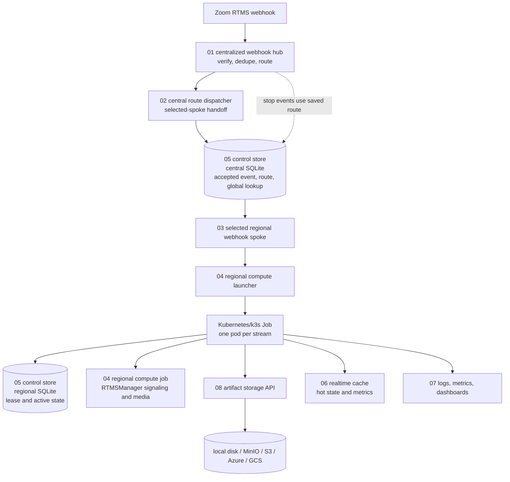
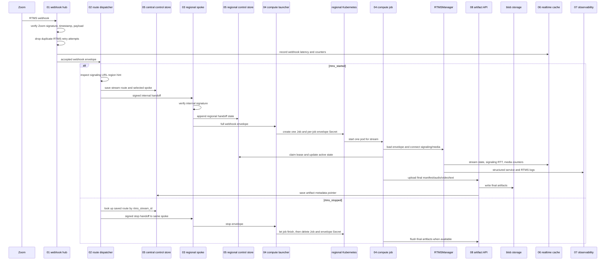

# RTMS Distributed Sample

This sample shows one practical way to run Zoom RTMS across regions without putting every responsibility into one server.

The short version:

- the public hub receives Zoom RTMS webhooks
- the hub chooses one regional spoke
- the spoke starts one worker for the stream
- the worker runs `RTMSManager`
- final audio/video/manifest files go through the artifact storage API
- live state goes to the realtime cache
- accepted webhook latency and Zoom signaling RTT go to the realtime cache
- service and RTMSManager logs go to the observability layer

This is still a sample, not a production blueprint. The important shape is fanout to the right region, then fanin through storage, cache, logs, and cleanup.

The local PM2 and Docker setup runs everything on one host only to make testing easier. In a real deployment, treat these as separate systems: the public hub in the central location, regional spokes and launchers near their target Zoom media regions, regional Kubernetes clusters for compute jobs, durable object storage, and a separate observability stack.

## Architecture Diagram



## Message And Artifact Flow



## Flow

```text
Zoom RTMS webhook
  -> 01 centralized webhook hub
  -> 02 central route dispatcher
  -> 05 control store, central route/control state
  -> selected 03 regional webhook spoke
  -> 04 regional compute launcher
  -> Kubernetes Job, one pod per stream
  -> 04 regional compute job / RTMSManager
  -> 05 control store, regional lease/active state
  -> 08 artifact storage for final files
  -> 06 realtime cache for active state and latency stats
  -> 07 observability for logs and dashboards
```

For `rtms_started`, the hub reads the Zoom signaling URL hint and maps it to a spoke group such as `amer-east`, `amer-west`, `europe`, or `apac-hub`.

For `rtms_stopped`, the hub uses the saved route for the `rtms_stream_id`. Stop events should go back to the same selected region.

For accepted RTMS webhooks, the hub records `webhook_ingress_latency_ms` as the time between Zoom's signed `x-zm-request-timestamp` and the hub receive time. For live RTMS connections, `RTMSManager` emits `signaling_ping_rtt_ms` after the signaling WebSocket answers a ping. The realtime cache dashboard shows lowest, highest, and average values for both.

The realtime cache dashboard also shows active streams, media volume in MiB, and rolling webhook counts for the past minute, 60 minutes, and 24 hours. The webhook counters separate total, accepted, unverified, and duplicate attempts.

Media volume is stored as byte counters and displayed as MiB. The compute job increments counters from the received RTMS media event buffer and flushes the totals to the realtime cache in batches, instead of writing one cache record per media packet.

## Folder Guide

| Folder | Purpose | Details |
|--------|---------|---------|
| [`01-centralized-webhook-hub/`](./01-centralized-webhook-hub/) | Public Zoom webhook receiver | [README](./01-centralized-webhook-hub/README.md) |
| [`02-central-route-dispatcher/`](./02-central-route-dispatcher/) | Local route dispatcher and optional RabbitMQ topology | [README](./02-central-route-dispatcher/README.md) |
| [`03-regional-webhook-spoke/`](./03-regional-webhook-spoke/) | Selected regional spoke | [README](./03-regional-webhook-spoke/README.md) |
| [`04-regional-compute-launcher/`](./04-regional-compute-launcher/) | Creates one Kubernetes Job per stream | [README](./04-regional-compute-launcher/README.md) |
| [`04-regional-compute-job/`](./04-regional-compute-job/) | Runs `RTMSManager`, records media, uploads final artifacts | [README](./04-regional-compute-job/README.md) |
| [`05-control-store/`](./05-control-store/) | SQLite control state, routes, leases, artifacts, documents | [README](./05-control-store/README.md) |
| [`06-realtime-cache/`](./06-realtime-cache/) | Live stream state and Prometheus metrics | [README](./06-realtime-cache/README.md) |
| [`07-observability-dashboarding/`](./07-observability-dashboarding/) | Grafana, Loki, Prometheus, OpenTelemetry configs | [README](./07-observability-dashboarding/README.md) |
| [`08-artifact-storage/`](./08-artifact-storage/) | One upload API for local disk, MinIO/S3, Azure, or GCS | [README](./08-artifact-storage/README.md) |
| [`shared/`](./shared/) | Shared helpers for signatures, HTTP, storage, retries, secrets | [README](./shared/README.md) |
| [`tests/`](./tests/) | Local integration and smoke tests | [README](./tests/README.md) |

## Quick Start

Install dependencies:

```bash
npm install
```

Create local config:

```bash
cp .env.example .env
```

Start local single-host infrastructure:

```bash
docker compose up -d realtime-cache object-storage prometheus loki otel-collector grafana
```

Start the core Node services in separate terminals. This is the local test shape; production should split these services across the central and regional systems described above.

```bash
npm run start:central-store
REGIONAL_STORE_PORT=4101 STORE_REGION=IAD npm run start:regional-store
npm run start:artifact-storage
npm run start:realtime-cache
INTERNAL_WEBHOOK_SECRET=internal-secret npm run start:dispatcher
SPOKE_REGION=IAD INTERNAL_WEBHOOK_SECRET=internal-secret npm run start:spoke
npm run start:hub
```

For local tests, use the test helpers:

```bash
npm run check
npm run test:04 -- --secret testsecrettoken
npm run test:08
npm run test:12:realtime-cache
```

For the full test list, see [`tests/README.md`](./tests/README.md).

## Filling `.env`

`.env.example` has the same active key list as the live deployment `.env`, but with safe placeholder values.

Fill these groups first:

| Group | Keys |
|-------|------|
| Zoom webhook verification | `ZOOM_SECRET_TOKEN`, `VIDEO_SECRET_TOKEN` |
| RTMS credentials | `ZOOM_CLIENT_ID`, `ZOOM_CLIENT_SECRET`, `VIDEO_CLIENT_ID`, `VIDEO_CLIENT_SECRET` |
| Service URLs | `CENTRAL_ROUTE_DISPATCHER_URL`, `SPOKE_AMER_WEST_URL`, `SPOKE_AMER_EAST_URL`, `SPOKE_EUROPE_URL`, `SPOKE_APAC_HUB_URL`, `COMPUTE_ENDPOINTS`, `REGIONAL_STORE_URL` |
| Kubernetes launcher | `KUBECONFIG`, `KUBECONFIG_INLINE_B64`, `K8S_COMPUTE_IMAGE`, `K8S_NAMESPACE` |
| Artifact storage | `ARTIFACT_STORAGE_PROVIDER`, `ARTIFACT_BUCKET`, `ARTIFACT_S3_ENDPOINT`, `AWS_ACCESS_KEY_ID`, `AWS_SECRET_ACCESS_KEY` |
| Realtime cache | `REDIS_PASSWORD`, `REALTIME_CACHE_REDIS_URL`, `REALTIME_CACHE_REDIS_PASSWORD` |
| Observability | `LOKI_PUSH_URL`, `COMPUTE_LOKI_PUSH_URL`, `SERVICE_LOG_LEVEL`, `RTMS_LOG_LEVEL` |
| Media request | `MEDIA_TYPES_FLAG`, `AUDIO_STREAM_MODE`, `VIDEO_STREAM_MODE` |

## Service URL Wiring

Use full URLs for cross-system calls. The local sample uses `127.0.0.1:port` only because every service can run on one host. In production these values should normally be HTTPS FQDNs, internal load balancer URLs, Kubernetes service DNS names, or service-mesh addresses. They do not need to be port-based.

```bash
CENTRAL_ROUTE_DISPATCHER_URL=https://rtms-dispatcher.us.internal/orchestrate/webhook

SPOKE_AMER_WEST_URL=https://rtms-spoke-amer-west.internal/spoke/webhook
SPOKE_AMER_EAST_URL=https://rtms-spoke-amer-east.internal/spoke/webhook
SPOKE_EUROPE_URL=https://rtms-spoke-europe.internal/spoke/webhook
SPOKE_APAC_HUB_URL=https://rtms-spoke-apac.internal/spoke/webhook
SPOKE_UNKNOWN_URL=https://rtms-spoke-amer-east.internal/spoke/webhook

REGIONAL_STORE_URL=https://rtms-control-store-amer-west.internal
COMPUTE_ENDPOINTS='["https://rtms-compute-launcher-amer-west.internal/compute/webhook"]'

COMPUTE_ARTIFACT_STORAGE_URL=https://rtms-artifacts.internal
COMPUTE_REALTIME_CACHE_URL=https://rtms-cache.internal
COMPUTE_LOKI_PUSH_URL=https://loki.internal/loki/api/v1/push
```

The dispatcher reads the readable `SPOKE_*_URL` values for the common four-spoke layout. `REGIONAL_SPOKE_ENDPOINTS` still works as a JSON override when you need custom route keys, extra spoke groups, or temporary failover targets.

`MEDIA_TYPES_FLAG=32` requests all available RTMS media. Use `3` for audio + video or `9` for audio + transcript.

For Kubernetes Jobs, changing the host `.env` is not enough. Update the Kubernetes Secret and recreate old failed Jobs so new pods receive current credentials.

For a local k3s cluster using a DNS endpoint, keep the kubeconfig server and TLS server name aligned. For example:

```yaml
server: https://proxmox-ubuntu-k3s.home.arpa:6443
tls-server-name: proxmox-ubuntu-k3s
```

`tls-server-name` is only needed when the API endpoint DNS name is not present in the k3s certificate SAN list. If you use `KUBECONFIG_INLINE_B64`, regenerate it after changing the kubeconfig file.

## Media And Artifacts

The compute job does not upload directly to MinIO or S3. It writes temporary media to pod scratch disk, finalizes files with the common media helpers, then uploads final outputs through [`08-artifact-storage`](./08-artifact-storage/README.md).

Expected final uploads include:

- `manifest.json`
- final `.wav` audio when audio is received
- final `.mp4` video when video is received
- transcript, summary, or other text artifacts when added by the app

Raw chunks stay temporary and should not be treated as user-facing artifacts.

## Reliability Notes

Keep these rules in mind while changing the sample:

- verify Zoom webhook signatures before routing
- accept a repeated RTMS webhook only once
- route stop events by saved `rtms_stream_id`
- let only one pod own a stream lease
- keep lease TTL below the RTMS reconnect window
- keep realtime cache disposable
- put large final files in object storage, not SQLite
- send service logs to Loki and active latency stats to the realtime cache
- keep `blog.md`, `.env`, recordings, `.data`, and `node_modules` out of git

## Useful Links

- [Test helpers](./tests/README.md)
- [Compute job media recording](./04-regional-compute-job/README.md)
- [Artifact storage API](./08-artifact-storage/README.md)
- [Realtime cache API](./06-realtime-cache/README.md)
- [Observability stack](./07-observability-dashboarding/README.md)
